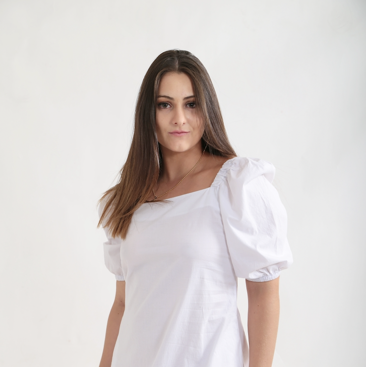

  <!-- Profile Image -->
  

  <!-- Intro Text -->
  

    <h1 style="margin-bottom: 0.3rem;">Maia Hirsch</h1>
    

      MAE 5190
    

  

<!-- Contact Links -->

  <a href="mailto:mh2567@cornell.edu">📧 Email</a> 
  <a href="https://github.com/maiahirsch">💻 GitHub</a> 
  <a href="https://instagram.com/maiahirschlab">📷 Instagram</a>

## Labs Directory

| Lab # | Lab Name |
|------:|----------|
| [Lab 1](lab1.md) | [Artemis and Bluetooth](lab1.md) |
| [Lab 2](lab2.md) | [IMU](lab2.md) |
| [Lab 3](lab3.md) | [ToF](lab3.md) |
| [Lab 4](lab4.md) | [Motor Drivers and Open Loop Control](lab4.md) |
| [Lab 5](docs/lab5.md) | [Linear PID and Linear Interpolation](lab5.md) |
| [Lab 6](docs/lab6.md) | [Orientation PID](lab6.md) |
| [Lab 7](docs/lab7.md) | [Kalman Filtering](lab7.md) |
| [Lab 8](docs/lab8.md) | [Stunts!](lab8.md) |
| [Lab 9](docs/lab9.md) | [Mapping](lab9.md) |
| [Lab 10](docs/lab10.md) | [Localization (sim)](lab10.md) |
| [Lab 11](docs/lab11.md) | [Localization (real)](lab11.md) |
| [Lab 12](docs/lab12.md) | [Planning and Execution](lab12.md) |
