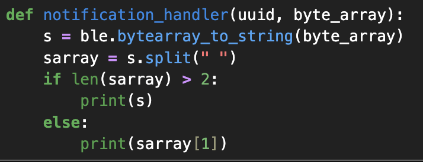

# Lab 1A

## Blink

<iframe width="560" height="315" src="https://www.youtube.com/embed/nM_cUpNXuFU?si=UiGdOjgL0qS2NQb6" title="YouTube video player" frameborder="0" allow="accelerometer; autoplay; clipboard-write; encrypted-media; gyroscope; picture-in-picture; web-share" referrerpolicy="strict-origin-when-cross-origin" allowfullscreen></iframe>

## Serial

<iframe width="560" height="315" src="https://www.youtube.com/embed/dYNelFfFumU?si=Cj7t4ho5kk9GpRc9" title="YouTube video player" frameborder="0" allow="accelerometer; autoplay; clipboard-write; encrypted-media; gyroscope; picture-in-picture; web-share" referrerpolicy="strict-origin-when-cross-origin" allowfullscreen></iframe>

## Temperature Sensor

<iframe width="560" height="315" src="https://www.youtube.com/embed/emRVZet1o7o?si=VkVn_TA0kB1KX25i" title="YouTube video player" frameborder="0" allow="accelerometer; autoplay; clipboard-write; encrypted-media; gyroscope; picture-in-picture; web-share" referrerpolicy="strict-origin-when-cross-origin" allowfullscreen></iframe>

## Microphone

<iframe width="560" height="315" src="https://www.youtube.com/embed/gg5GWId_iys?si=lU0Z6rz9q5LlY1yW" title="YouTube video player" frameborder="0" allow="accelerometer; autoplay; clipboard-write; encrypted-media; gyroscope; picture-in-picture; web-share" referrerpolicy="strict-origin-when-cross-origin" allowfullscreen></iframe>

## Electronic Tuner (5000-level)

# Lab 1B: 

## Prelab

## Task 1:Echo 

The <mark>ECHO</mark> command was used to verify that the communication between the computer and the board was functioning correctly. This command instructs the board to return the same string that it receives from the computer. To test this, I sent the string <mark>“HiHello”</mark> to the board. The board responded with the augmented message <mark>“Robot says → HiHello :)”</mark>, which I observed in my notebook, confirming that the string was correctly received and processed by the board. The returned string was also successfully received by the computer, verifying bidirectional communication.

## Task 2: SEND_THREE_FLOATS

The <mark>SEND_THREE_FLOATS</mark> command instructs the board to transmit three floating-point values to the computer. This command was implemented as an extension of the existing <mark>SEND_TWO_INTS</mark> command that was already provided. I modified the original implementation to support floating-point values instead of integers. The three floating-point values are transmitted and printed to the serial monitor for verification.

## Task 3:GET_TIME_MILLIS

I added a new command, <mark>GET_TIME_MILLIS</mark>, that makes the robot respond with the current time (in milliseconds) formatted as a string.
In the C code, I added `GET_TIME_MILLIS` to the `CommandTypes` enum and implemented a new `case GET_TIME_MILLIS:` in the command handler. In the Python code, I added the corresponding command entry in `cmd_types.py` so I could send the command from my notebook.

I used `millis()` to get the current time since the board started running, converted it into a string with a `"T:"` prefix, and wrote it to the **string TX characteristic** (and also printed it to the serial monitor for debugging). On the computer side, I sent the command and verified that the received string matched the expected format.

I ran into a lot of errors with GET_TIME_MILLIS missing from CMD and fixed it by restarting the Kernel. 

Reference: https://akinfelami.github.io/fastrobots-2025/artemis-and-bluetooth and https://rga47-lab.github.io/lab1.html

## Task 4: Notification Handler 

To improve communication efficiency between the computer and the robot, I implemented a notification-based approach for receiving string data from the board. Instead of explicitly calling a receive function every time a response was needed, I set up a notification handler that automatically processes incoming data from the RX string characteristic.

On the Python side, I defined a custom notification handler that converts the received byte array into a string and parses the message. Since some responses include multiple tokens (e.g., sample index and timestamp), the handler checks the length of the parsed string before printing the appropriate output. I then enabled notifications on the RX string characteristic. 

Once notifications were enabled, I sent the GET_TIME_MILLIS command from the computer. The board responds by sending back the current timestamp (in milliseconds) formatted as a string (e.g., T:387094.000). This response is automatically received and printed by the notification handler.

Reference: https://rga47-lab.github.io/lab1.html

5. Write a loop that gets the current time in milliseconds and sends it to your laptop to be received and processed by the notification handler. Collect these values for a few seconds and use the time stamps to determine how fast messages can be sent. What is the effective data transfer rate of this method?

Reference: https://akinfelami.github.io/fastrobots-2025/artemis-and-bluetooth

I then used the following methodology to determine the effective data transfer rate of this method after all 1000 time stamps were received.

Taking the last time stamp T:95213.000 minus the first time stamp T:93824.000. The message rate is 100 over the difference between time staps (1.389). There are approximately 720 messages being sent / sec. My message has 12 bytes, one per character. meaning 8640 bytes/sec

chsnged it to new notification handler. updated time stamps screenshot. 117 time stamps. need to do math again 

6. Now create an array that can store time stamps. This array should be defined globally so that other functions can access it if need be. In the loop, rather than send each time stamp, place each time stamp into the array. (Note: you’ll need some extra logic to determine when your array is full so you don’t “over fill” the array.) Then add a command SEND_TIME_DATA which loops the array and sends each data point as a string to your laptop to be processed. (You can store these values in a list in python to determine if all the data was sent over.)

reference: https://sgb1443.github.io/ece4160/Lab1B/

7. Add a second array that is the same size as the time stamp array. Use this array to store temperature readings. Each element in both arrays should correspond, e.e., the first time stamp was recorded at the same time as the first temperature reading. Then add a command GET_TEMP_READINGS that loops through both arrays concurrently and sends each temperature reading with a time stamp. The notification handler should parse these strings and add populate the data into two lists.

