# Lab 1A

## Blink

<iframe width="560" height="315" src="https://www.youtube.com/embed/nM_cUpNXuFU?si=UiGdOjgL0qS2NQb6" title="YouTube video player" frameborder="0" allow="accelerometer; autoplay; clipboard-write; encrypted-media; gyroscope; picture-in-picture; web-share" referrerpolicy="strict-origin-when-cross-origin" allowfullscreen></iframe>

## Serial

<iframe width="560" height="315" src="https://www.youtube.com/embed/dYNelFfFumU?si=Cj7t4ho5kk9GpRc9" title="YouTube video player" frameborder="0" allow="accelerometer; autoplay; clipboard-write; encrypted-media; gyroscope; picture-in-picture; web-share" referrerpolicy="strict-origin-when-cross-origin" allowfullscreen></iframe>

## Temperature Sensor

<iframe width="560" height="315" src="https://www.youtube.com/embed/emRVZet1o7o?si=VkVn_TA0kB1KX25i" title="YouTube video player" frameborder="0" allow="accelerometer; autoplay; clipboard-write; encrypted-media; gyroscope; picture-in-picture; web-share" referrerpolicy="strict-origin-when-cross-origin" allowfullscreen></iframe>

## Microphone

<iframe width="560" height="315" src="https://www.youtube.com/embed/gg5GWId_iys?si=lU0Z6rz9q5LlY1yW" title="YouTube video player" frameborder="0" allow="accelerometer; autoplay; clipboard-write; encrypted-media; gyroscope; picture-in-picture; web-share" referrerpolicy="strict-origin-when-cross-origin" allowfullscreen></iframe>

## Electronic Tuner (5000-level)

# Lab 1B: 

## Prelab

## Lab Tasks

### Task 1:Echo 

The <mark>ECHO</mark> command was used to verify that the communication between the computer and the board was functioning correctly. This command instructs the board to return the same string that it receives from the computer. To test this, I sent the string <mark>“HiHello”</mark> to the board. The board responded with the augmented message <mark>“Robot says → HiHello :)”</mark>, which I observed in my notebook, confirming that the string was correctly received and processed by the board. The returned string was also successfully received by the computer, verifying bidirectional communication.

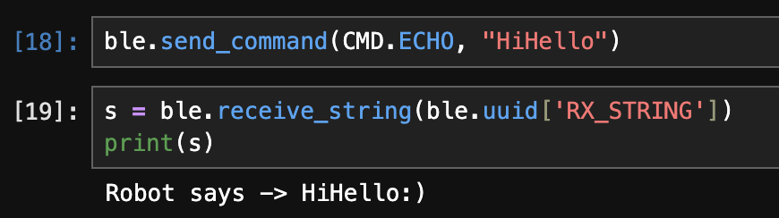


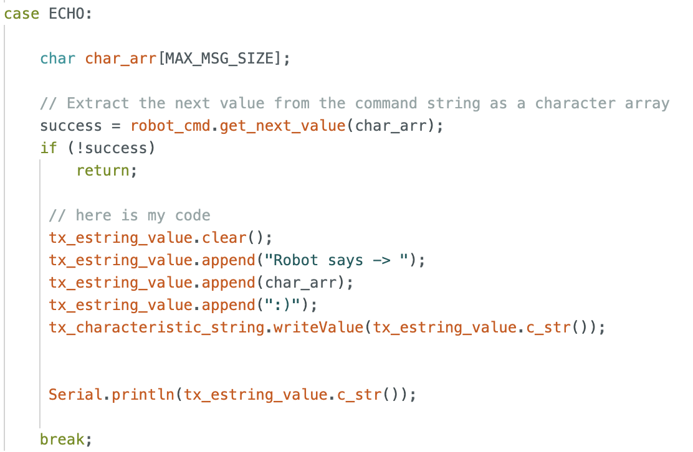

### Task 2: SEND_THREE_FLOATS

The <mark>SEND_THREE_FLOATS</mark> command instructs the board to transmit three floating-point values to the computer. This command was implemented as an extension of the existing <mark>SEND_TWO_INTS</mark> command that was already provided. I modified the original implementation to support floating-point values instead of integers. The three floating-point values are transmitted and printed to the serial monitor for verification.


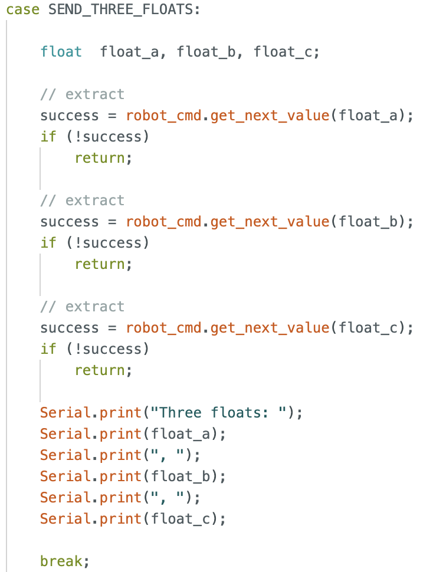

### Task 3:GET_TIME_MILLIS

I added a new command, <mark>GET_TIME_MILLIS</mark>, that makes the robot respond with the current time (in milliseconds) formatted as a string.
In the C code, I added `GET_TIME_MILLIS` to the `CommandTypes` enum and implemented a new `case GET_TIME_MILLIS:` in the command handler. In the Python code, I added the corresponding command entry in `cmd_types.py` so I could send the command from my notebook.

I used `millis()` to get the current time since the board started running, converted it into a string with a `"T:"` prefix, and wrote it to the **string TX characteristic** (and also printed it to the serial monitor for debugging). On the computer side, I sent the command and verified that the received string matched the expected format.

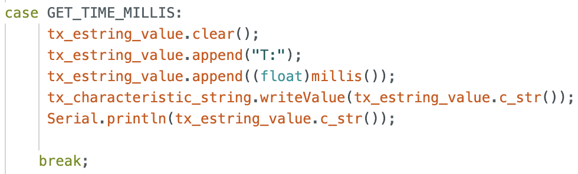
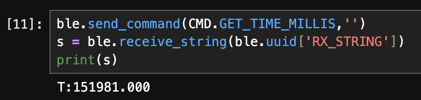
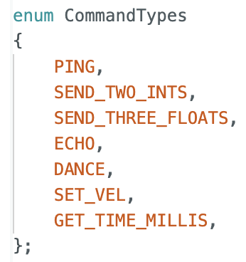
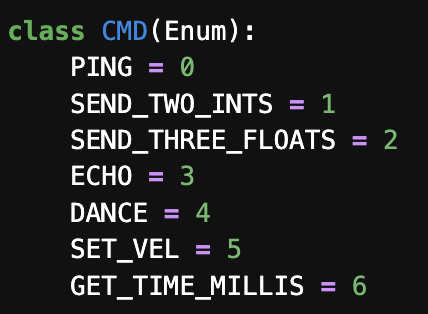

I ran into a lot of errors with GET_TIME_MILLIS missing from CMD and fixed it by restarting the Kernel. 

Reference: https://akinfelami.github.io/fastrobots-2025/artemis-and-bluetooth and https://rga47-lab.github.io/lab1.html

### Task 4: Notification Handler 

To improve communication efficiency between the computer and the robot, I implemented a notification-based approach for receiving string data from the board. Instead of explicitly calling a receive function every time a response was needed, I set up a notification handler that automatically processes incoming data from the RX string characteristic.

On the Python side, I defined a custom notification handler that converts the received byte array into a string and parses the message. Since some responses include multiple tokens (e.g., sample index and timestamp), the handler checks the length of the parsed string before printing the appropriate output. I then enabled notifications on the RX string characteristic. 
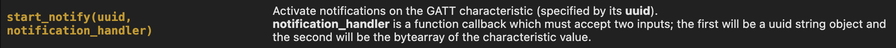

```c
def notification_handler(uuid, byte_array):
    s = ble.bytearray_to_string(byte_array)
    sarray = s.split(" ")
    if len(sarray) > 2:
        print(s)
    else:
        print(sarray[1])
```

Once notifications were enabled, I sent the GET_TIME_MILLIS command from the computer. The board responds by sending back the current timestamp (in milliseconds) formatted as a string (e.g., T:387094.000). This response is automatically received and printed by the notification handler.


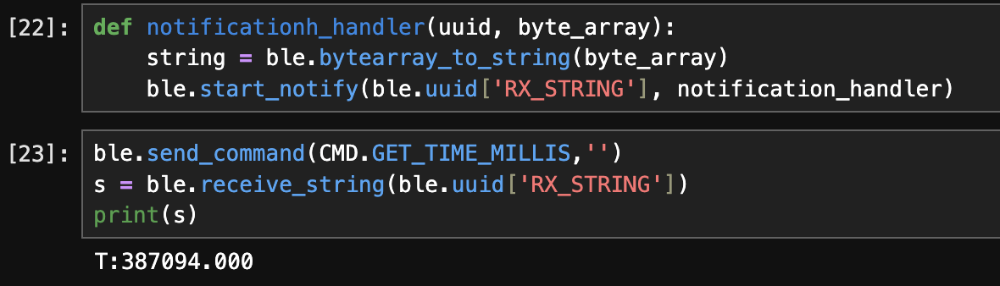

Reference: https://rga47-lab.github.io/lab1.html

### Task 5: GET_TIME_MILLIS_LOOP & Data Transfer Rate

To measure how fast the robot can stream data to my laptop using BLE notifications, I implemented a new command called **GET_TIME_MILLIS_LOOP**. This command continuously sends timestamp messages for a fixed duration of **3 seconds**. Each message contains a sample counter and the current time in milliseconds (from `millis()`), formatted as:

`Sample: X, T: Y`

```c
case GET_TIME_MILLIS_LOOP: {

    int sample = 0; 
    unsigned long startTime = millis();

    // create a loop to retrieve data for 3 seconds 
    while(millis() - startTime < 3000) {
        tx_estring_value.clear();
        tx_estring_value.append("Sample: ");
        tx_estring_value.append(sample);
        tx_estring_value.append(", T: ");
        tx_estring_value.append((float)millis());
        tx_characteristic_string.writeValue(tx_estring_value.c_str());
        sample++;
    }
    Serial.println("sent all");
    break;
}
```
On the laptop, I enabled notifications on the RX string characteristic and then sent the command:

```
ble.start_notify(ble.uuid['RX_STRING'], notification_handler)
ble.send_command(CMD.GET_TIME_MILLIS_LOOP, '')
```

The notification handler automatically printed each incoming message:
```c
Sample: 0, T: 40292
Sample: 1, T: 40292
Sample: 2, T: 40292
Sample: 3, T: 40293
.
.
.
Sample: 152, T: 43196
Sample: 153, T: 43225
Sample: 154, T: 43253
Sample: 155, T: 43284
```

First timestamp: T = 40292 (Sample 0)
Last timestamp: T = 43284 (Sample 155)

Elapsed time: Δt = 43284 − 40292 = 2992 ms = 2.992 s

Number of messages received: 156 messages

Messages per second ≈ 156 / 2.992 ≈ 52.1 messages/s
Average time per message ≈ 2.992 / 156 ≈ 19.2 ms/message
Each message is approximately "Sample: X, T: Y" which is ~20 characters ≈ 20 bytes.
**Effective data transfer rate:** Data rate ≈ 52.1 × 20 ≈ 1040 bytes/s

6. Now create an array that can store time stamps. This array should be defined globally so that other functions can access it if need be. In the loop, rather than send each time stamp, place each time stamp into the array. (Note: you’ll need some extra logic to determine when your array is full so you don’t “over fill” the array.) Then add a command SEND_TIME_DATA which loops the array and sends each data point as a string to your laptop to be processed. (You can store these values in a list in python to determine if all the data was sent over.)

### Task 6: Buffering Time Stamps and Sending Them in a Separate Command

For this task, I modified my implementation so that the robot **stores time stamps locally first** (instead of transmitting each time stamp immediately). I created a global array to hold the time data, collected timestamps for a fixed duration (3 seconds), and then implemented a new command, **SEND_TIME_DATA**, which loops through the stored array and sends each stored data point back to my laptop as a formatted string. On the Python side, I received the streamed strings using my BLE notification handler.

To make the time data accessible across functions, I defined the storage array globally. I also initialized it to zeros so that I could use `0` as a stopping condition when sending the data.

```c
//////////// Global Variables ////////////
unsigned long currentMillis = 0;
int time_data[5000] = {0};
```

Inside the SEND_TIME_DATA command case, I first collected time stamps for 3 seconds using millis(). Instead of sending each value during collection, I stored each time stamp into the time_data array. I also included logic to avoid overflowing the array.

```c
case SEND_TIME_DATA: {

            int i = 0; 
            unsigned long startTime = millis();
            // create a loop to retrieve data for 3 seconds 
            while(millis() - startTime < 3000) {
                //prevent overflow
                time_data[i] = millis();
                i++; 
                if(i == 9,999)
                    Serial.println("Array Full");
            }
            Serial.println("Data Collected");
```
After collection was complete, I looped through the stored values and transmitted each one as a formatted string:

Sample: j, T: time_data[j]

The loop stops once it reaches the last collected sample.
```c
for (int j = 0; j < i; j++) {
    tx_estring_value.clear();
    tx_estring_value.append("Sample: ");
    tx_estring_value.append(j);
    tx_estring_value.append(", T: ");
    tx_estring_value.append(time_data[j]);
    tx_characteristic_string.writeValue(tx_estring_value.c_str());
}
Serial.println("sent all");
```
On the Python side, I reused my BLE notification handler and started notifications on the RX string characteristic. Then I sent the SEND_TIME_DATA command. The board streamed all stored samples, and the notification handler printed them as they arrived.

```c
ble.start_notify(ble.uuid['RX_STRING'], notification_handler)
ble.send_command(CMD.SEND_TIME_DATA, '')
```

```c
Sample: 0, T: 1048364
Sample: 1, T: 1048365
Sample: 2, T: 1048366
Sample: 3, T: 1048367
.
.
.
Sample: 1951, T: 1051358
Sample: 1952, T: 1051359
Sample: 1953, T: 1051360
Sample: 1954, T: 1051361
Sample: 1955, T: 1051362
```

This implementation confirms that the robot can buffer sensor/time data locally and then transmit it reliably in a separate step, which is useful when sampling at high speed but sending data over BLE more slowly.

Reference: https://sgb1443.github.io/ece4160/Lab1B/

### Task 7: Time-Stamped Temperature Data Collection

I extended the previous time-stamp data collection to include temperature readings, ensuring that each temperature measurement corresponds exactly to a recorded time stamp. To accomplish this, I added a second global array to store temperature values and implemented a new command, GET_TEMP_READINGS, that collects and transmits both data streams together.

I defined a second array, temp_data, with the same indexing scheme as the existing time_data array. Both arrays are populated concurrently inside a timed loop so that each index represents a synchronized measurement pair.

```c
int time_data[5000] = {0};
float temp_data[500] = {0.0};
```

Within the GET_TEMP_READINGS command, the board collects time stamps using millis() and temperature readings using getTempDegF() for a duration of three seconds. Each measurement pair is stored at the same index to preserve correspondence.

```c
case GET_TEMP_READINGS: {
            int i = 0; 
            unsigned long startTime = millis();
            // create a loop to retrieve data for 3 seconds 
            while(millis() - startTime < 3000) {
                //prevent overflow
                time_data[i] = millis();
                temp_data[i] = getTempDegF();
                i++; 
                if(i == 9,999)
                    Serial.println("Array Full");
            }
            Serial.println("Data Collected");

            for (int j = 0; j <= i; j++) {

                if(time_data[j] == 0)
                    break; 

                tx_estring_value.clear();
                tx_estring_value.append("Sample: ");
                tx_estring_value.append(j);
                tx_estring_value.append(", T: ");
                tx_estring_value.append(time_data[j]);
                tx_estring_value.append(", Temp: ");
                tx_estring_value.append(temp_data[j]);
                tx_characteristic_string.writeValue(tx_estring_value.c_str());
    
            }
            Serial.println("sent all");

            break;
```
Each data point is sent as a formatted string over the BLE string characteristic, allowing the central device to parse the information reliably.

On the Python side, I modified the notification handler to parse the incoming strings, extract the time and temperature values, and display them with appropriate units. The handler splits each message into its components and formats the output for readability.

This approach cleanly separates data transmission (Arduino) from data presentation and parsing (Python), making the system easier to debug and extend.
After starting notifications and sending the GET_TEMP_READINGS command, the laptop successfully received and displayed a sequence of synchronized measurements:


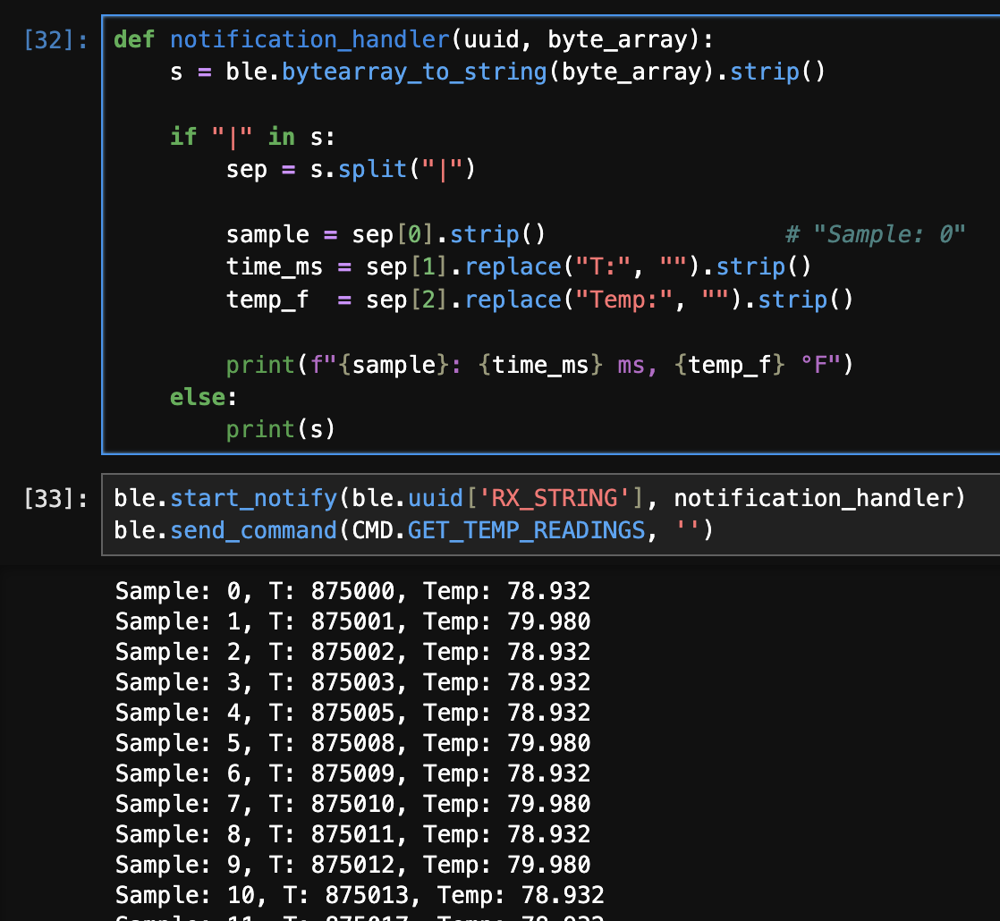
Each temperature reading corresponds to the exact time at which it was recorded, confirming that the two arrays remained synchronized throughout data collection.

### Task 8: Comparison of Streaming vs. Buffered Data Collection Methods

In this lab, two different methods were used to transmit time-stamped data from the Artemis board to the laptop: (1) streaming data immediately as it is generated, and (2) buffering data in memory before transmitting it. Each method has distinct advantages and disadvantages depending on data rate, memory usage, and timing accuracy.

---

#### Method 1: Immediate Streaming (`GET_TIME_MILLIS_LOOP`)

In the first method, the Artemis computes the current time in milliseconds and sends it to the laptop on each loop iteration using BLE notifications. Data is transmitted immediately as it is generated.

**Advantages**
- Provides real-time feedback on the laptop.
- Requires minimal memory on the Artemis, since no large arrays are stored.
- Suitable for long-duration experiments where memory usage must be minimized.

**Disadvantages**
- The effective data rate is limited by BLE transmission overhead.
- Timing jitter is introduced due to communication delays, resulting in repeated or uneven timestamps.
- The sampling rate is constrained by BLE throughput rather than the board’s ability to record data.

From earlier measurements, this method achieved an effective data transfer rate of approximately **276 bytes per second**, indicating that BLE notifications are a bottleneck when streaming continuously.

---

#### Method 2: Buffered Recording and Transmission (`SEND_TIME_DATA` / `GET_TEMP_READINGS`)

In the second method, data is first recorded locally into arrays on the Artemis and transmitted only after data collection is complete. This decouples data acquisition from BLE communication.

**Advantages**
- Significantly higher effective data recording and transfer rates.
- More accurate and consistent timestamps, since recording is not delayed by BLE transmission.
- BLE communication occurs only after data collection finishes.

**Disadvantages**
- Limited by the available RAM on the Artemis.
- Requires additional logic to prevent array overflow.
- Data is not available in real time.

To estimate how quickly this method can record data, the difference between the first and last timestamps was divided by the total number of samples. For example, recording 1000 samples over approximately 32 milliseconds corresponds to an effective recording rate of:

\[
\frac{1000}{0.032} \approx 31{,}250 \text{ samples per second}
\]

This rate reflects the speed of writing to memory rather than BLE transmission and is several orders of magnitude faster than the streaming approach.

---

#### Memory Constraints and Storage Capacity

The Artemis board has **384 kB of RAM**, which corresponds to: 

384 × 1024 = 393,216 bytes

A single timestamp stored as a 32-bit integer requires **4 bytes**, so the theoretical maximum number of timestamps that could be stored is:

393,216 / 4 ≈ 98,000 samples

In practice, the Artemis must also allocate memory for the BLE stack, buffers, program variables, and the call stack. Therefore, a more realistic estimate is approximately **80,000–90,000 timestamps**.

When storing both time and temperature data, each sample consists of:
- one 32-bit timestamp (4 bytes)
- one 32-bit floating-point temperature value (4 bytes)

This results in **8 bytes per sample**, reducing the practical storage capacity to approximately **40,000–45,000 synchronized samples**.

- The **streaming method** is best suited for real-time monitoring and low-rate data collection where memory usage must be minimized.
- The **buffered method** enables much faster and more accurate data recording but is constrained by available RAM.
- The choice between the two methods depends on whether real-time visibility or high-rate, low-jitter data acquisition is the primary goal.

Overall, buffering data locally before transmission provides a significant performance advantage when memory constraints allow it.

### Additional tasks (5000-level)

#### 1. Effective Data Rate And Overhead

To evaluate the effective data rate and communication overhead between the computer and the Artemis board, I implemented a command that echoes back a string sent from the computer.
Response sizes ranged from 3 bytes to 72 bytes, and for each message size, I measured the round-trip response time between sending the command and receiving the echoed reply. The response time was measured using Python’s time.time() function. The effective data rate was then computed as: 
Data Rate = Response Size/ Response Time

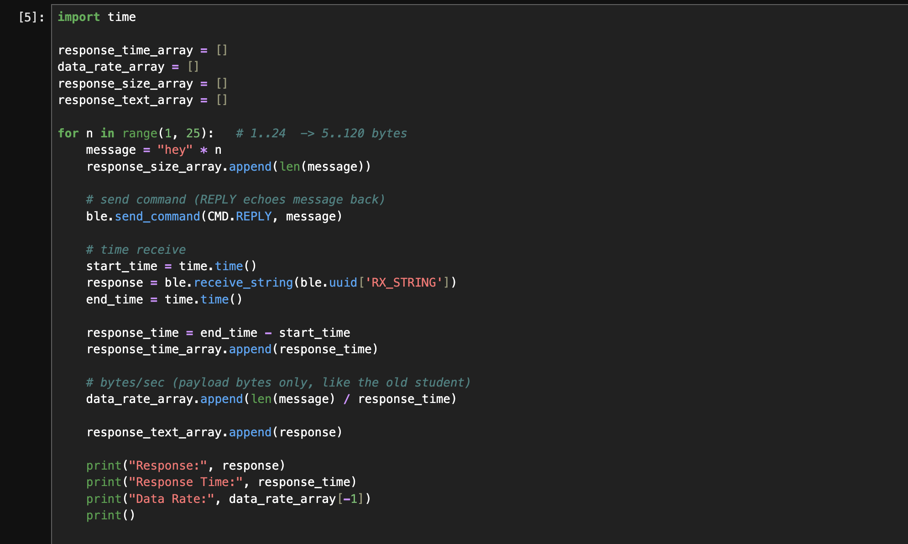
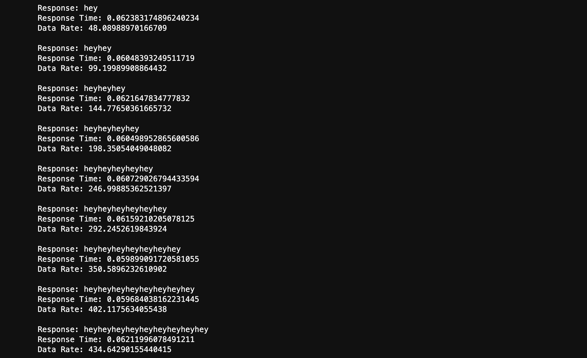

Across all response sizes, the measured response time remained approximately constant at around 60 ms, regardless of payload size. As a result, the effective data rate increased with increasing response size. Short messages (e.g., 3 bytes) resulted in low data rates, while longer messages (e.g., 72 bytes) achieved significantly higher data rates.
The scatter plot below shows the relationship between response size and effective data rate.

Reference: https://neverlandiz.github.io/fast_robots/

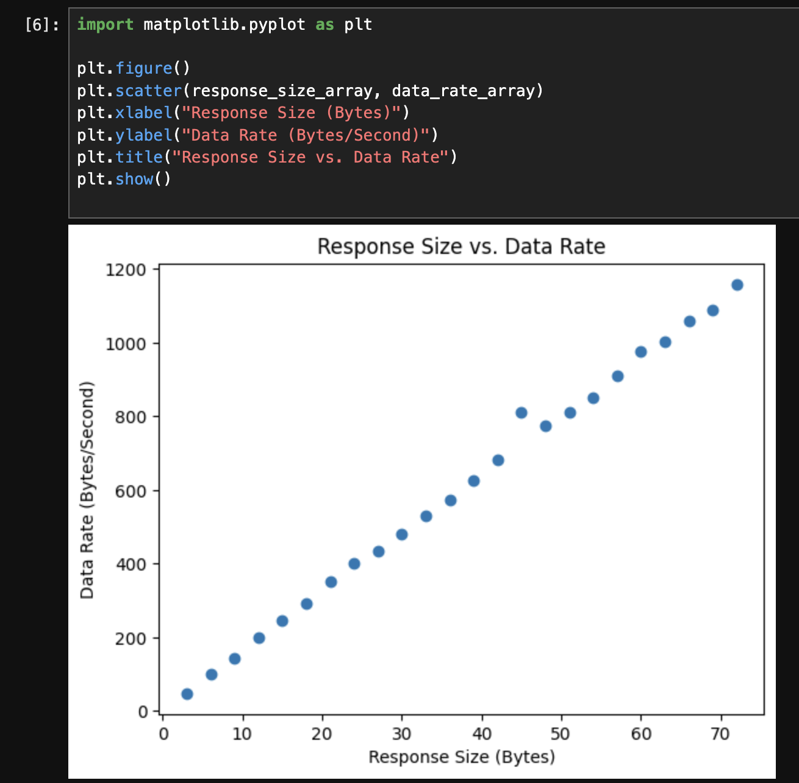


#### 2. Reliability

## Discussion 

In this lab, I learned how to design and compare different data acquisition and transmission strategies using BLE on the Artemis board. I explored the trade-offs between streaming data in real time versus buffering data locally before transmission, and how BLE throughput and on-board memory constraints affect system performance.
One of the main challenges was debugging timing and parsing issues caused by BLE communication overhead and string formatting. Repeated timestamps and parsing errors highlighted the importance of separating data collection from data transmission and carefully defining message formats. Most issues were resolved by restarting the kernel.
Overall, this lab reinforced the importance of considering communication bottlenecks, memory limitations, and system-level design choices when working with embedded systems and wireless data transfer.

