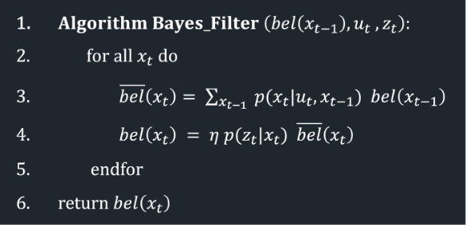

# Lab 10: Grid Localization using Bayes Filter

## Pre-lab

I set up the simulation during class following the instructions provided. 

## Overview

As I found in previous labs, adometry alone drifts fast and we have no idea of how wrong we are to the "true location". In this lab, instead of tracking a single estimated pose, I maintain a _belief_, a probability distribution over all possible poses, and update it continuously using a Bayes Filter. 

## The Setup

The robot's state is defined by its x position, y position, and heading θ. We discretize the environment into a 12x9x18 grid, where each cell covers 1x1 ft of floot space and 20° of orientation. Each cell stores a probability and together all cells sum to 1 and represent where the robot thinks it is. 

## Algorithm 

Every iteration of Bayes filter has two steps: 
1. `prediction step` that incorporated motion and increases uncertainty
2. `update step` that incorporated sensor readings and reduces uncertainty

See screenshot from lecture 17 below: 



Here, `bel(x_{t-1})` is the previous belief — a 3D matrix where each cell holds the probability that the robot occupies that pose. `u_t` is the control input responsible for moving the robot from x_{t-1} to x_t, and `z_t` is the current sensor observation: 18 ToF readings taken at 20° increments around the robot.
Each iteration loops over every possible current pose x_t = (x, y, θ). For each one, we weight the probability by the previous belief and sum across all prior states to get the predicted (prior) belief bel̄(x_t). We then correct this prediction by how well the sensor readings z_t match what we'd expect at that pose, normalize by η so everything sums to 1, and arrive at the updated belief bel(x_t).

### Motion Model

Motion is described using the odometry motion model: any movement between two poses can be broken into an initial rotation, a translation, and a final rotation. I implemented `compute_control()` to extract these three parameters from a pair of poses: 

```python

def compute_control(cur_pose, prev_pose):
    """ Given the current and previous odometry poses, this function extracts
    the control information based on the odometry motion model.

    Args:
        cur_pose  ([Pose]): Current Pose
        prev_pose ([Pose]): Previous Pose 

    Returns:
        [delta_rot_1]: Rotation 1  (degrees)
        [delta_trans]: Translation (meters)
        [delta_rot_2]: Rotation 2  (degrees)
    """

    # Get position and rotation components from current and previous poses
    cur_x, cur_y, cur_theta = cur_pose
    prev_x, prev_y, prev_theta = prev_pose

    # Calculate the first rotation, then normalize to (-180, 180)
    delta_rot_1 = mapper.normalize_angle(
        np.degrees(np.arctan2(cur_y - prev_y, cur_x - prev_x)) - prev_theta,
    )

    # Calculate the translation as a hypotenuse
    delta_trans = np.hypot(cur_y - prev_y, cur_x - prev_x)

    # Calculate the second rotation, then normalize to (-180, 180)
    delta_rot_2 = mapper.normalize_angle(cur_theta - prev_theta - delta_rot_1)

    return delta_rot_1, delta_trans, delta_rot_2
```

From there, `odom_motion_model()` computes the probability of a pose transition by treating each of the three motion parameters as a Gaussian centered on the actual control input:

```python
def odom_motion_model(cur_pose, prev_pose, u):
    """ Odometry Motion Model

    Args:
        cur_pose  ([Pose]): Current Pose
        prev_pose ([Pose]): Previous Pose
        (rot1, trans, rot2) (float, float, float): A tuple with control data in the format 
                                                   format (rot1, trans, rot2) with units (degrees, meters, degrees)


    Returns:
        prob [float]: Probability p(x'|x, u)
    """

    # Get control parameters from the current and previous poses
    delta_rot_1, delta_trans, delta_rot_2 = compute_control(cur_pose, prev_pose)

    # Determine the probabilities of the control parameters
    prob_rot_1 = loc.gaussian(delta_rot_1, u[0], loc.odom_rot_sigma)
    prob_trans = loc.gaussian(delta_trans, u[1], loc.odom_trans_sigma)
    prob_rot_2 = loc.gaussian(delta_rot_2, u[2], loc.odom_rot_sigma)

    prob = prob_rot_1 * prob_trans * prob_rot_2

    return prob
```
### Prediction Step

The prediction step loops over every pair of previous and current grid cells and accumulates a new prior belief `bel_bar`. To keep this tractable, the grid has 1,944 cells, I skip any previous-state cell with probability below 0.0001, since these contribute essentially nothing to the result. 

```python

def prediction_step(cur_odom, prev_odom):
    """ Prediction step of the Bayes Filter.
    Update the probabilities in loc.bel_bar based on loc.bel from the previous time step and the odometry motion model.

    Args:
        cur_odom  ([Pose]): Current Pose
        prev_odom ([Pose]): Previous Pose
    """

    # Get control parameters from odometry
    u = compute_control(cur_odom, prev_odom)

    # Initialize bel bar
    loc.bel_bar = np.zeros((mapper.MAX_CELLS_X, mapper.MAX_CELLS_Y, mapper.MAX_CELLS_A))

    # Loop over the entire grid
    for prev_x in range(mapper.MAX_CELLS_X):
        for prev_y in range(mapper.MAX_CELLS_Y):
            for prev_theta in range(mapper.MAX_CELLS_A):
                # Skip states with very low probabilities to speed up the prediction
                if (loc.bel[prev_x, prev_y, prev_theta] < 0.0001): continue

                for cur_x in range(mapper.MAX_CELLS_X):
                    for cur_y in range(mapper.MAX_CELLS_Y):
                        for cur_theta in range(mapper.MAX_CELLS_A):
                            # Calculate the transition probability
                            p = odom_motion_model(
                                mapper.from_map(cur_x, cur_y, cur_theta),
                                mapper.from_map(prev_x, prev_y, prev_theta),
                                u
                            )

                            # Keep running sum of bel_bar
                            loc.bel_bar[cur_x, cur_y, cur_theta] += p * loc.bel[prev_x, prev_y, prev_theta]

    # Normalize bel bar
    loc.bel_bar /= np.sum(loc.bel_bar)

```

### Sensor Model

At each pose, the robot collects 18 ToF readings at 20° increments. The sensor model evaluates how likely each of those readings is, given the known true distances for that grid cell. Each reading is modeled as a Gaussian around the true value:

```python
def sensor_model(obs):
    """ This is the equivalent of p(z|x).


    Args:
        obs ([ndarray]): A 1D array consisting of the true observations for a specific robot pose in the map 

    Returns:
        [ndarray]: Returns a 1D array of size 18 (=loc.OBS_PER_CELL) with the likelihoods of each individual sensor measurement
    """

    # Calculate the probabilities of the given observations
    return [loc.gaussian(obs[i], loc.obs_range_data[i], loc.sensor_sigma)
        for i in range(mapper.OBS_PER_CELL)]

    return prob_array
```

### Update Step

The update step multiplies the prior belief by the sensor likelihood at each cell, then normalizes:

```python
def update_step():
    """ Update step of the Bayes Filter.
    Update the probabilities in loc.bel based on loc.bel_bar and the sensor model.
    """

    # Loop over the grid
    for cur_x in range(mapper.MAX_CELLS_X):
        for cur_y in range(mapper.MAX_CELLS_Y):
            for cur_theta in range(mapper.MAX_CELLS_A):
                # Get the sensor model and update the belief
                p = sensor_model(mapper.get_views(cur_x, cur_y, cur_theta))
                loc.bel[cur_x, cur_y, cur_theta] = np.prod(p) * loc.bel_bar[cur_x, cur_y, cur_theta]

    # Normalize bel
    loc.bel /= np.sum(loc.bel)
```

## Results 

Without the Bayes filter, the odometry trace (red) wanders off immediately and produces nonsense — it even exits the map boundaries. With the filter running, the probabilistic belief (blue) tracks the ground truth (green) closely throughout the trajectory. The filter is especially confident near walls, where sensor readings are consistent and informative. In open areas near the center of the map, the belief spreads out a bit more, which makes sense given the relative lack of distinguishing features.

<iframe width="560" height="315" src="https://www.youtube.com/embed/dO1FyaNEtl8?si=cYycPlT32QxwgvE_" title="YouTube video player" frameborder="0" allow="accelerometer; autoplay; clipboard-write; encrypted-media; gyroscope; picture-in-picture; web-share" referrerpolicy="strict-origin-when-cross-origin" allowfullscreen></iframe>

<iframe width="560" height="315" src="https://www.youtube.com/embed/AHQIGxCXnvs?si=_9HYrz6_0gTcsna_" title="YouTube video player" frameborder="0" allow="accelerometer; autoplay; clipboard-write; encrypted-media; gyroscope; picture-in-picture; web-share" referrerpolicy="strict-origin-when-cross-origin" allowfullscreen></iframe>

## Conclusion

In this lab, we demonstrated that committing to a single pose estimate allows error to compound drastically over time due to noise in sensing or actuation. Maintaining a distribution and updating it with every piece of available information is a much more robust strategy. Given how noisy our ToF sensors can be in practice (affected by surface angle, ambient light, and so on), it genuinely makes more sense to treat every measurement as a weighted hint rather than ground truth.

## References

I referenced Stefan Wagner's code and structure for this report. 
