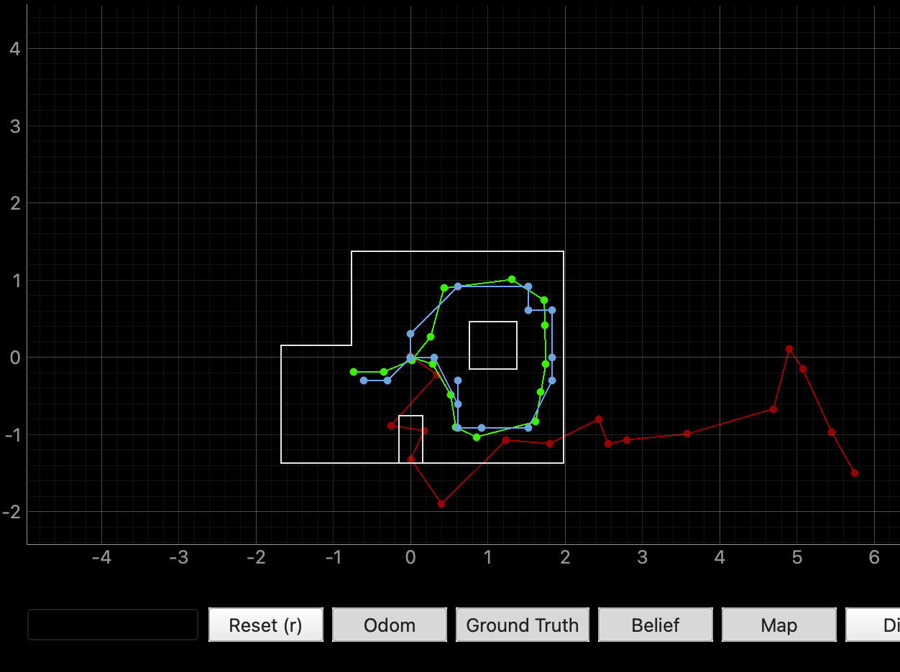
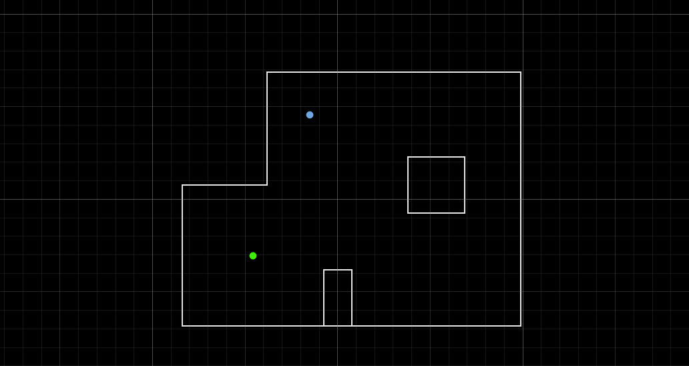
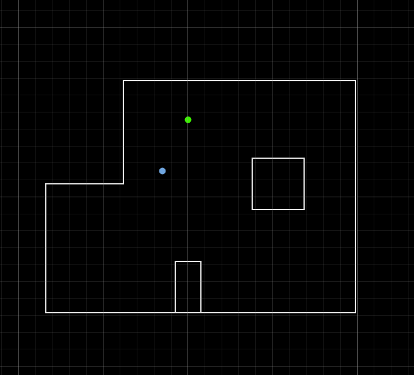
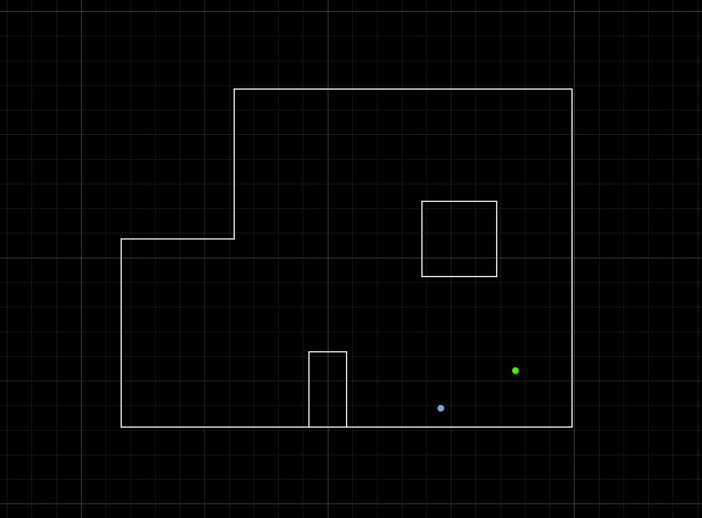
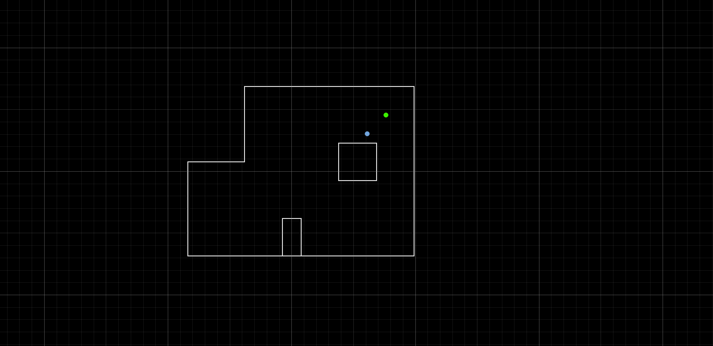

# Lab 11: Localization on the real robot 

## Task 1: Test Localization in Simulation

I verified by Bayes filter implementation by running `lab11_sim.ipynb. Below is a screenshot of the final plot including odom, ground truth and belief. 



This looks very similar to my results obtained in lab 10: 

<iframe width="560" height="315" src="https://www.youtube.com/embed/AHQIGxCXnvs?si=TQWESg7CyupgWk9v" title="YouTube video player" frameborder="0" allow="accelerometer; autoplay; clipboard-write; encrypted-media; gyroscope; picture-in-picture; web-share" referrerpolicy="strict-origin-when-cross-origin" allowfullscreen></iframe>

## Task 2.1: implement perform_observation_loop

To perform localization on the real robot, I implemented `perform_observation_loop()` in the `RealRobot` class. The function sends a `START_MAPPING` command I used in lab 9 over BLE, which triggers my existing orientation PID scan routine. The robot rotates in place, settling at each step before taking 5 averaged ToF readings from the front sensor. Then I request the data with `SEND_MAPPING_DATA` and collect distance readings which are returned as a numpy column array in meters. 

I initially configured 18 steps at 20°. However, after getting poor localization results at the (-3,-2) pose, I tried increasing the resolution to 36 steps at 10° increments, hoping that more readings would give the Bayes filter more information to worth with. This did not solve the problem. I will discuss more in the results section. 

```python
    def perform_observation_loop(self, rot_vel=120):
        """Perform the observation loop behavior on the real robot, where the robot does  
        a 360 degree turn in place while collecting equidistant (in the angular space) sensor
        readings, with the first sensor reading taken at the robot's current heading. 
        The number of sensor readings depends on "observations_count"(=18) defined in world.yaml.
        
        Keyword arguments:
            rot_vel -- (Optional) Angular Velocity for loop (degrees/second)
                        Do not remove this parameter from the function definition, even if you don't use it.
        Returns:
            sensor_ranges   -- A column numpy array of the range values (meters)
            sensor_bearings -- A column numpy array of the bearings at which the sensor readings were taken (degrees)
                               The bearing values are not used in the Localization module, so you may return a empty numpy array
        """

        self._data_buffer = []
        self._mapping_done = False

        def notify_handler(uuid, byte_array):
            msg = ble.bytearray_to_string(byte_array)
            if msg.startswith("Mapping done"):
                self._mapping_done = True
            elif msg.startswith("Y:"):
                try:
                    parts = msg.split(",")
                    yaw   = float(parts[0].split(":")[1])
                    dist  = float(parts[1].split(":")[1])  # front sensor, mm
                    self._data_buffer.append((yaw, dist))
                except Exception as e:
                    LOG.warning(f"Bad msg: {msg} | {e}")

        ble.start_notify(ble.uuid['RX_STRING'], notify_handler)

        # Command the robot to scan
        ble.send_command(CMD.ENABLE_MOTORS, "")
        # Set orient gains first!
        ble.send_command(CMD.SET_ORIENT_GAINS, "3.0|0.0|0.3")
        time.sleep(0.5)
        ble.send_command(CMD.START_MAPPING, "")

        # Wait for scan to finish
        t0 = time.time()
        while not self._mapping_done and (time.time() - t0) < 90:
            time.sleep(0.25)
        LOG.info(f"Scan done in {time.time()-t0:.1f}s, requesting data...")

        # Request data
        ble.send_command(CMD.SEND_MAPPING_DATA, "")
        t1 = time.time()
        while len(self._data_buffer) < self.num_steps and (time.time() - t1) < 10:
            time.sleep(0.1)

        ble.stop_notify(ble.uuid['RX_STRING'])
        LOG.info(f"Got {len(self._data_buffer)} readings")

        # Build output arrays
        dists = np.array([d[1] for d in self._data_buffer]) / 1000.0  # mm -> m
        yaws  = np.array([d[0] for d in self._data_buffer])           # degrees

        return dists[np.newaxis].T, yaws[np.newaxis].T
```

## Results 

I tested localization at all four marked poses. The green dot represents the ground truth and the blue dot represents the Bayes filter belief after the update step. 

### (-3 ft, -2 ft)

This pose was the most challenging. The belief consistently landed about 1-2 grid cells away from the ground truth, sometimes drifting toward the upper left region of the map. I think this is because the left side of the map is geometrically less distinctive — the distances to the surrounding walls are similar to other parts of the map, making it hard for the filter to identify this position.



### ( 0 ft, 3 ft)

This pose localized reasonably well, with the belief landing close to the ground truth. The upper wall nearby provides a distinctive close reading that helps anchor the filter.



### (5 ft, -3 ft)

Good result here. The belief was very close to the ground truth. The combination of the right wall and the inner box obstacle creates a distinctive sensor signature that the filter matches well.



### (5 ft, 3 ft)

Also a good result, with the belief landing near the ground truth. Similar to (5, -3), the right side of the map has enough geometric features to localize well.



## Discussion 
Overall the Bayes filter worked reasonably well on the real robot, with 3 out of 4 poses localizing within the quadrant of ground truth. The (-3, -2) pose was by far the hardest, and I believe it is because of the geometry of that part of the map. The left side of the arena is relatively open and symmetric — the distances to the surrounding walls are similar to other regions, so multiple grid cells produce similar expected sensor readings and the filter can't uniquely identify the position.

The other three poses at (0, 3), (5, -3), and (5, 3) performed better, though still not perfect due to drift. Because the robot is a differential drive system it doesn't spin perfectly in place — one side consistently had less traction than the other, causing the robot to translate slightly during the scan. This means the ToF readings are taken from shifted positions compared to where the filter expects them, introducing error across all poses. This error compounds over a full 360 turn. 

