# Lab 2

## Prelab

Read and got familiar with the IMU we will be using. The IMU was connected to the Artemis board using the QWIIC connector. I installed the ICM-20948 library. 

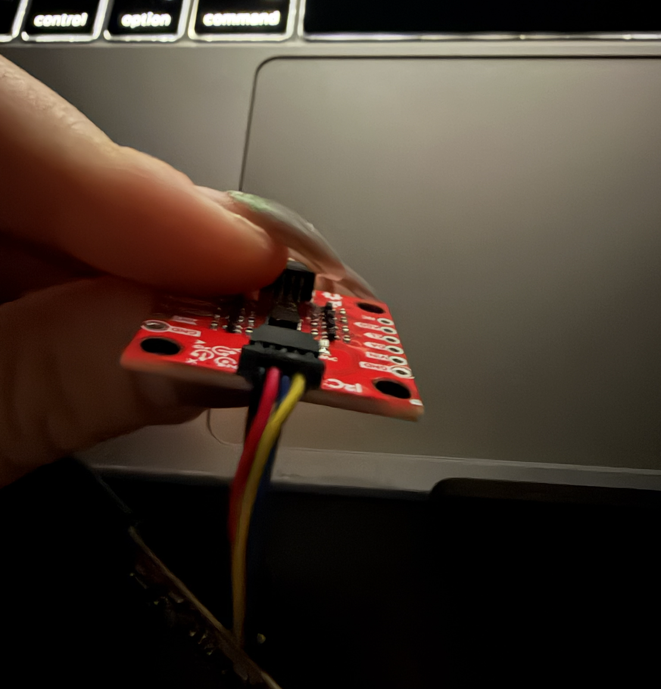

## Lab Tasks

### Setup the IMU 

I installed the “SparkFun 9DOF IMU Breakout_ICM 20948_Arduino Library” during lecture.

I ran the “..\Arduino\libraries\SparkFun_ICM-20948\SparkFun_ICM-20948_ArduinoLibrary-master\examples\Arduino\Example1_Basics”. 

<iframe width="560" height="315" src="https://www.youtube.com/embed/f_yZHpNvcfE?si=GYR3WE7zYYTnpPrH" title="YouTube video player" frameborder="0" allow="accelerometer; autoplay; clipboard-write; encrypted-media; gyroscope; picture-in-picture; web-share" referrerpolicy="strict-origin-when-cross-origin" allowfullscreen></iframe>

From the [data sheet](https://learn.sparkfun.com/tutorials/sparkfun-9dof-imu-icm-20948-breakout-hookup-guide/all) of the IMU, AD0_VAL is the value of the last bit of the I2C address. The default is 1, and when the ADR jumper is closed the value becomes 0. 

When rotating the board, the accelerometer showed gravity shifting between the axes. 

I added a blink code to see when the board is running. 

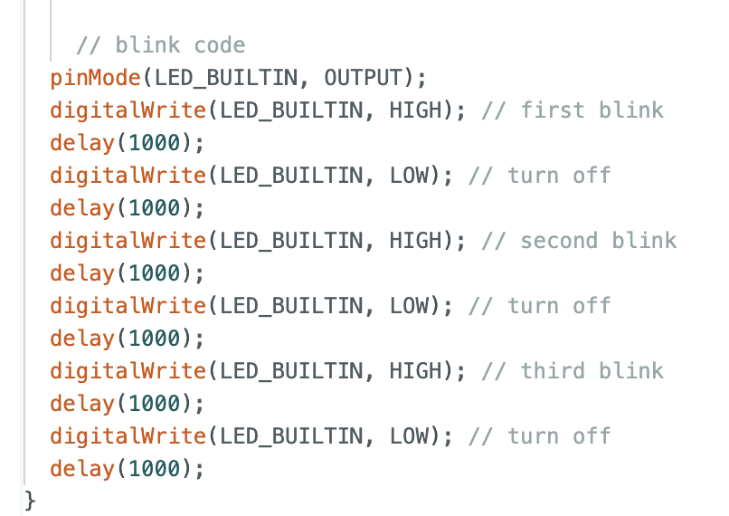

As this is a YouTube Shorts and cannot be embedded, please [CLICK HERE](https://youtube.com/shorts/w1GEfw5nUFw?feature=share) to watch the video.

### Accelerometer 

I included the math.h library in Arduino. Then using the class slide, I added this conversion 

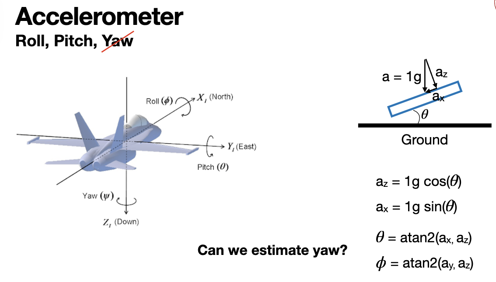

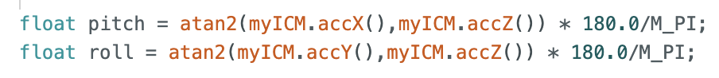

As this is a YouTube Shorts and cannot be embedded, please [CLICK HERE](https://youtube.com/shorts/UaUIQhe_3lE?feature=share) to watch the **pitch video** -90 0 90. 

As this is a YouTube Shorts and cannot be embedded, please [CLICK HERE](https://youtube.com/shorts/F5NgczmTyRg?feature=share) to watch the **roll video** -90 0 90. 

The accelerometer is quite accuracy if it is held steady at an angle. But still the sensor readings keep changing. A fourier transform will assist with filtering out the noise from the sensor readings.

I followed the Fourier transform for Python tutorial provided. 

To analize noise, I collected accelerometer data keeping the IMU still and tapping on the table to induce vobration. Shown below is the FFT signal for both cases. 

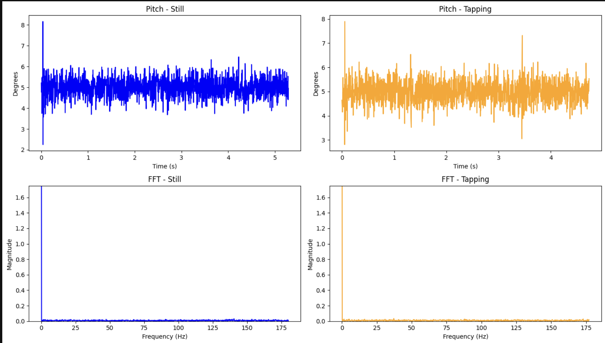

The FFT shows that noise is very low in both cases as the ICM-20948 already has a low pass filter on board. Even under vibration there is no significant high frequency spikes. A cuttoff frequency of **5 Hz** was chosen for the low pass filter. A lower cutoff would add more lag; a higher one would let through more noise.

The low-pass filter implemented was as follows: 

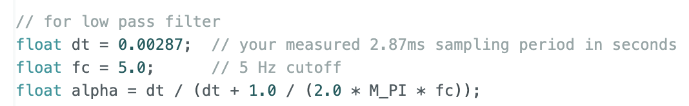
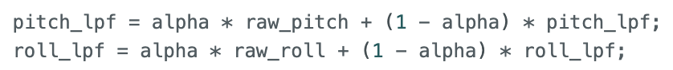

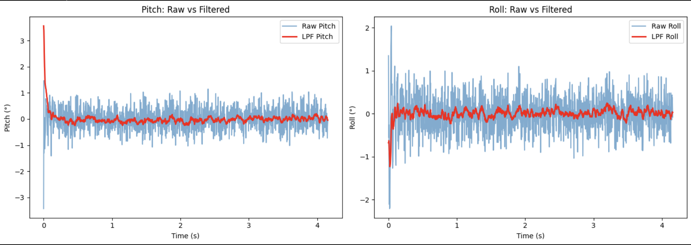

The filtered signal is much smoother than the raw signal while tracking true angle accurately. 

### Gyroscope 

Pitch, roll, and yaw were computed by integrating the gyroscope angular rate over time: 

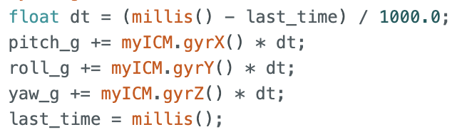

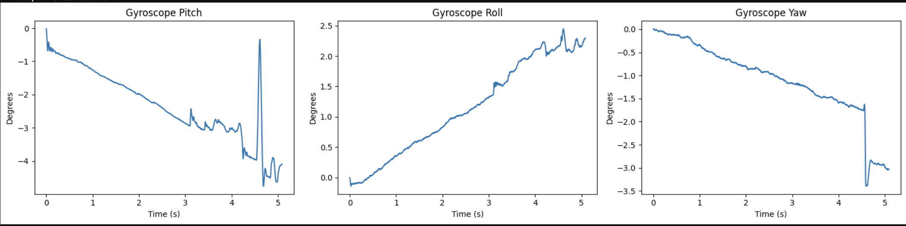

The gyroscope clearly showed drift over time because of the integration. The angle slowly gets farther away from the true value as the board is still. Yaw can only be measured by the gyroscope. Since gravoty has no yaw component the accelerometer cannot measure yaw. 

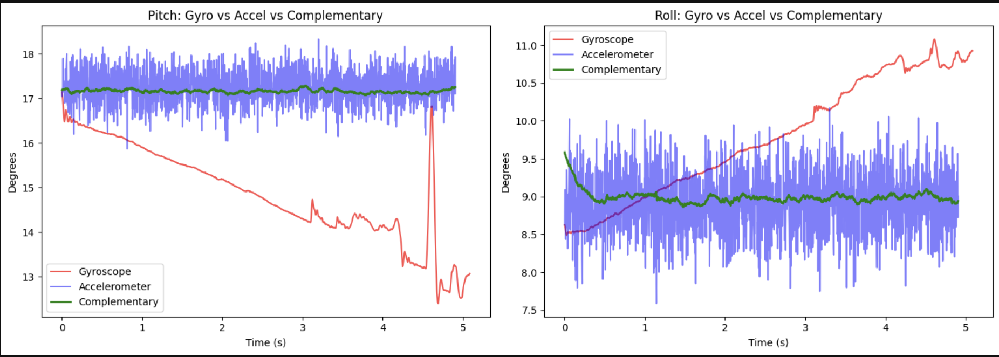

The accelerometer is noisy but stable. The gyroscope is smooth but drifts significantly. The complementary filter combines both resulting in a smooth and drift-free estimate. 

The complimentary filter was implemented as:

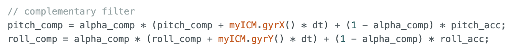

where alpha_comp = 0.98.

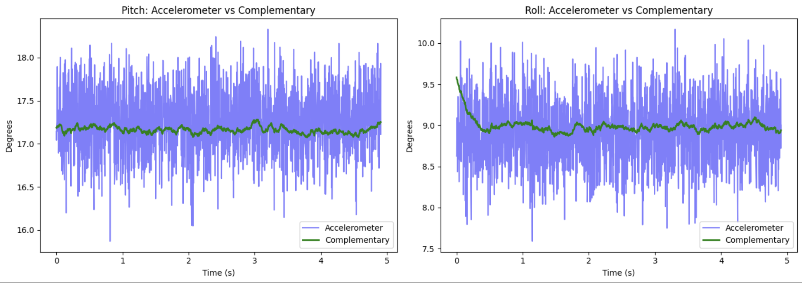

### Sample Data

To maximize sample speed, as suggested, all delays and Serial.print statements were removed. IMU data was collected in the main loop using a flag to strat and stop recording: 

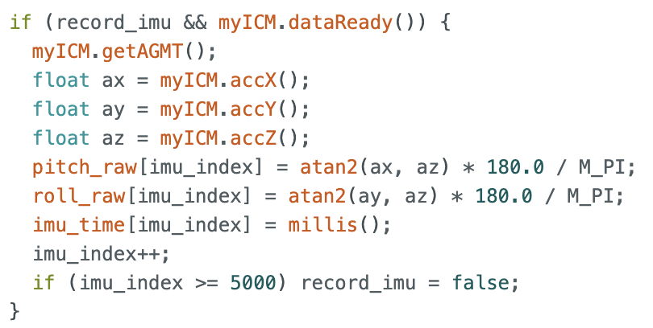

The Artemis achieved a sampling rate of **445 Hz**. The main loop check 'dataReady()' and moves on without waiting. Separate arrays were used for accelerometer and dyroscope data as they serve different purposes and can be samples at different times. 

The Artemis has 384kB of RAM. With 10 arrays of 5000 elements at 4 bytes each, that is approximately 200kB used, leaving ~184kB free. at 445 Hz, pitch, roll and time, can be stored for approximately **23 seconds** before running out of space. 

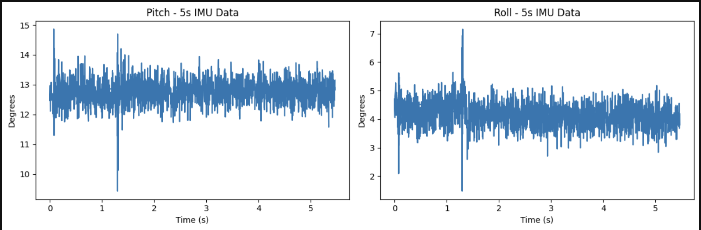

### The Stunt!

Here is the final task of the lab performing a stunt with the RC car to evaluate its capabilities: 

As this is a YouTube Shorts and cannot be embedded, [FIND THE STUNT HERE](https://youtube.com/shorts/qDWf7uRGerk?si=053rA-M1fdW1hEby)

The RC car was driven in the hallway for several minutes. The car accelerates quickly from rest. Forward and backward speeds are similar, Turning is more responsive at higher speeds and the car tends to drift when turning sharply while going fast. 

## Discussion 

This lab provided hands-on experience with IMU data collection and sensor fusion. The biggest challenge was managing BLE transmission speed — the Artemis can sample at 445 Hz but BLE becomes the bottleneck when sending large amounts of data, which is why the store-then-send approach is preferable to streaming in real time. 

The complementary filter was an important takeaway: neither the accelerometer nor gyroscope alone is sufficient, but combining them produces stable, accurate angle estimates.

### References
I used the plots of student [Kotey Ashie](https://kotey538.github.io/fast_robots.github.io/) as guidance to check my results made sense. 
