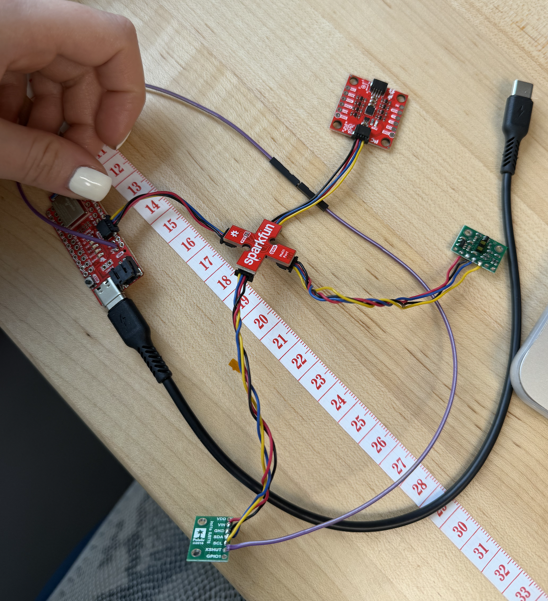
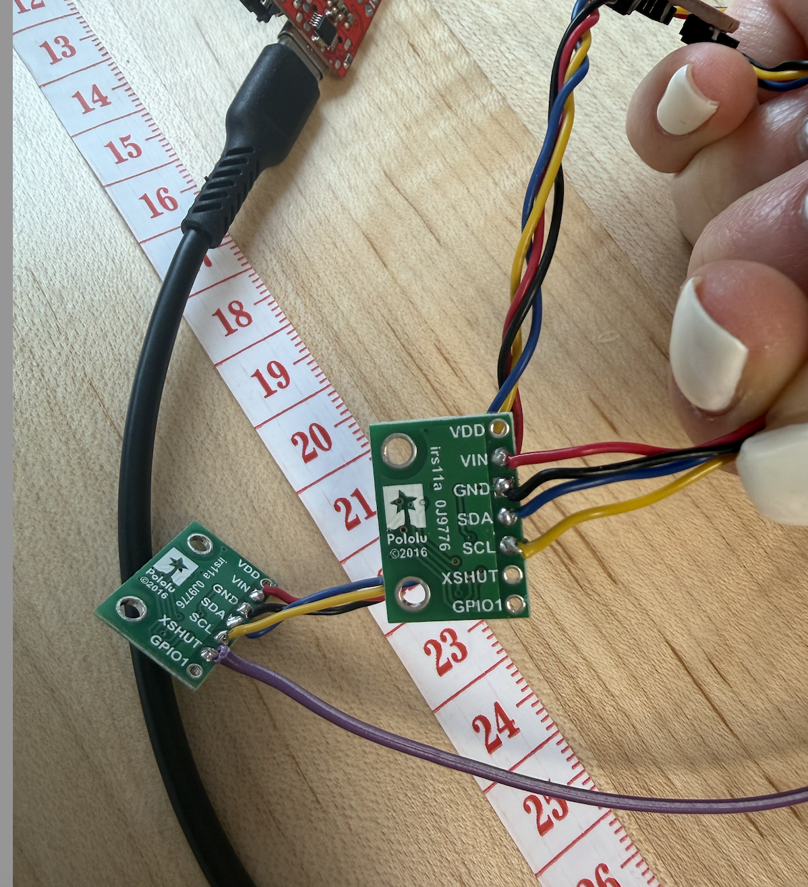
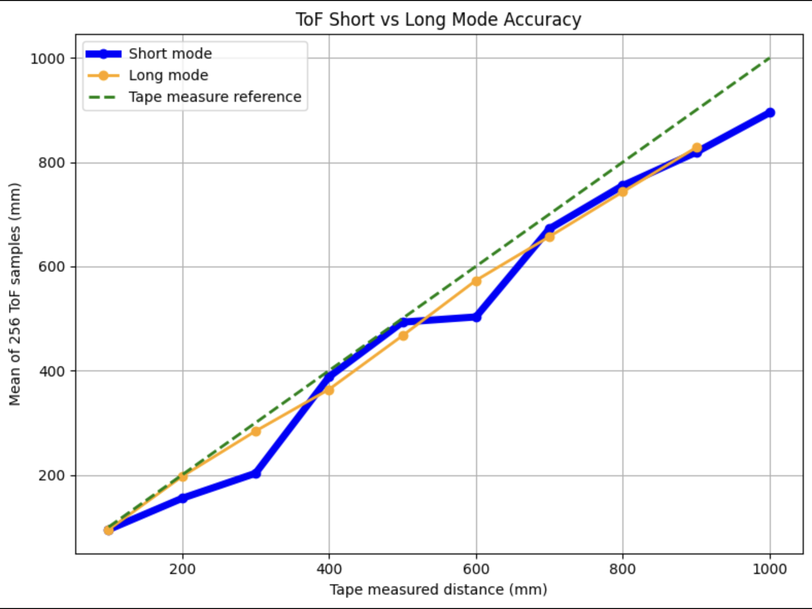
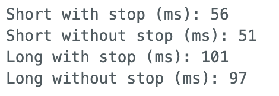
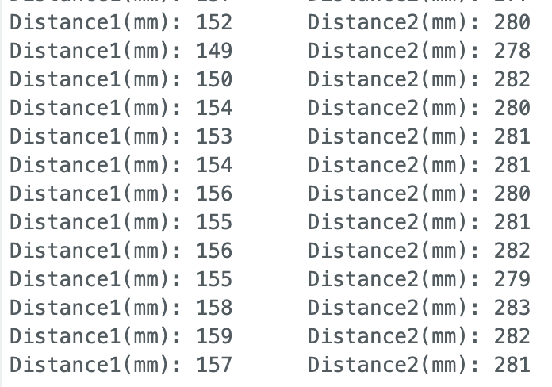
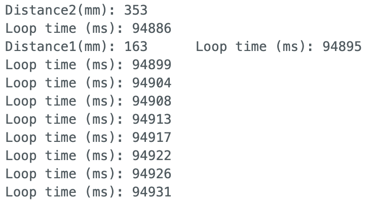
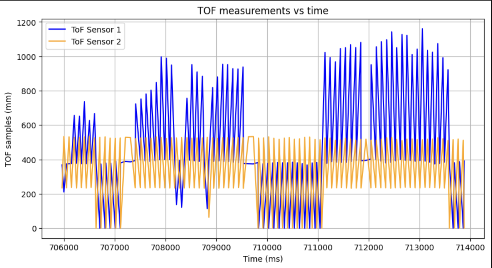
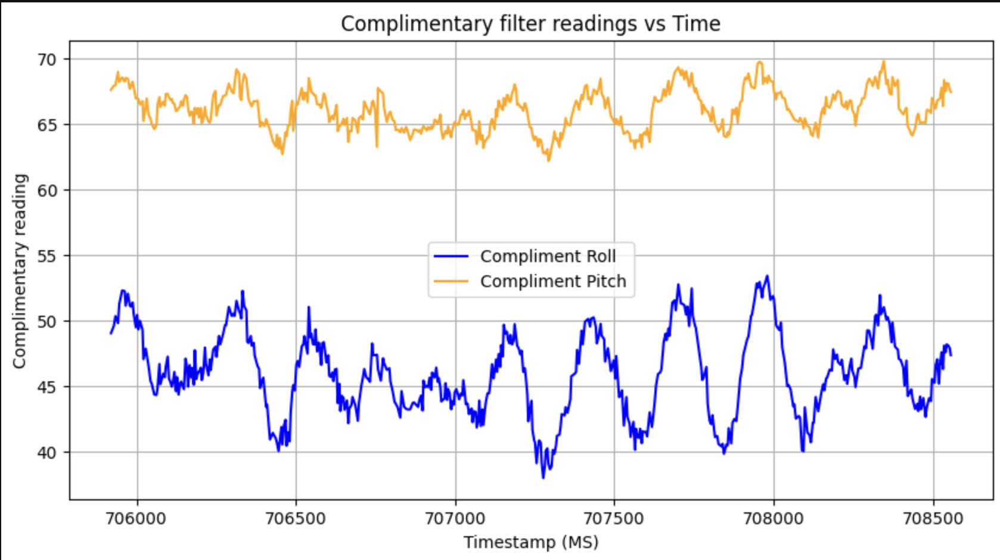
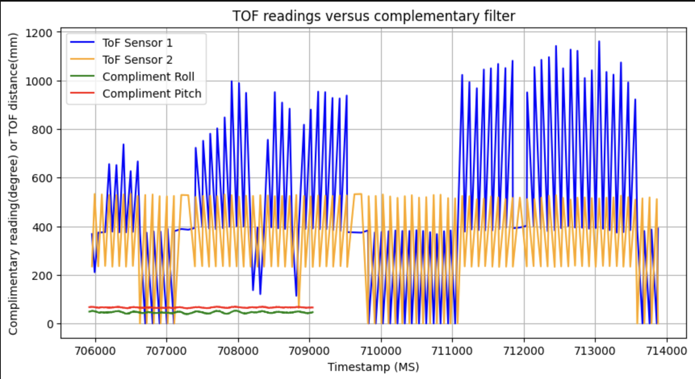

# Prelab

## I2C Address

The VL53L1X ToF sensor has a default 12C address of 0x29 (7-bit), which corresponds to  0 x 52 in the 8-bit addressing convention used in the datasheet. The Arduino Wire library uses 7-bit addressing, so **0x29** is the address I will use in the code. 

## Two Sensor Approach 

Both sensors share the same default a dress and this is problematic as they have to be modified to be used simultaneously. I used the XSHUT pin approach: on startup, the XSHUT pin of sensor 2 is pulled LOW to disable it, then sensor 1's address is changed to 0x30. Sensor 2 is then re-enabled via XSHUT and boots at the default 0x29. Both sensors can now be addressed independently on the same I2C bus at the same time. 

## Sensor Placement 

For the final robot, I plan to mount one sensor facing forward and one facing on the side. The forward sensor handles the primary obstacle detection for the stop-before-wall task. The side sensor helps detect lateral obstacles during turns. Obstacles will be missed if objects are very low to the ground, below the sensor's field of view. Objects approaching from behind and objects outside the angular sensitivity cone of each sensor will also be missed, although I do not expect any objects approaching from behind. 

## Wiring Diagram


Both sensors connect to the QWIIC breakout board via QWIIC cables (SDA, SCL, VCC, GND). Sensor 2 has an additional wire from its XSHIT pin to GPIO pin A0 on the Artemis for shutdown control. 

# Lab Tasks

## ToF sensor connected to QWIIC breakout board




## I2C Scan


The I2C scan detected the ToF sensor at address 0x29, matching the expected 7-bit address. The IMU was also detected at 0x69. The seconf I2C port showed no devices since all sensors are connected to the same bus. 

## Distance Mode Selection 

I tested both Short and Long distance modes between 100mm and 1000mm, averaging 256 readings at each positions. The results are plotted below: 



Interestingly, Long mode tracked the reference line more smoothly throughout the range, while Short mode showed irregularities, particularly a flat region around 500 - 600mm where readings plateaued before catching up. Despite this, I chose Short mode for the final robot for two reasons. 

1. Short mode's ranging time is nearly half that of Long mode (~56ms vs ~101ms), meaning the robot can sample twice as fast and this is critical for last-minute stops.
2. The robot only required reliable detection within ~1.3m, which is well within Short mode's specified range.



## 2 ToF sensors and the IMU

Using the XSHUT addressing approach described in the prelab, both sensors were initialized at different addresses (0x29 and 0x30) and operated simultaneously. The setup code is as follows: 

```
  // Disable sensor 2 before anything else
  pinMode(SHUTDOWN_PIN, OUTPUT);
  digitalWrite(SHUTDOWN_PIN, LOW);

  // Init dual ToF sensors
  delay(10);
  distanceSensor1.setI2CAddress(0x30);
  digitalWrite(SHUTDOWN_PIN, HIGH);
  delay(50);

  distanceSensor1.setDistanceModeShort();
  distanceSensor2.setDistanceModeShort();
```



## Tof sensor speed

To maximize loop speed, I used a non-blocking approach with checkForDataReady() rather than waiting for each measurement to complete: 

```
        if (distanceSensor1.checkForDataReady()) {
          tof1_data[tof_index] = distanceSensor1.getDistance();
          distanceSensor1.clearInterrupt();
          got1 = true;
        }
        if (distanceSensor2.checkForDataReady()) {
          tof2_data[tof_index] = distanceSensor2.getDistance();
          distanceSensor2.clearInterrupt();
          got2 = true;
```



The loop executes every 4-5ms when no sensor data is ready. New ToF data arrives every ~50ms, matching the Short mode ranging time measured earlier. The limiting factor is the sensor's measurement cycle, not the microcontroller's processing speed. 

## Time v Distance

ToF data was collected over bLE using a START_IMU flag that simultaneously triggered both ToF sensors and the IMU. Data was stored in arrays and transmitted after collection. 



Both sensors respond clearly to objects being moved in front of them, with sensor 1 and sensor 2 tracking different distances simultaneously. 

## Time v Angle: Include graph of data sent over bluetooth

IMU complimentary filter data was collected simultanously and sent over BLE: 



Both ToF sensors and IMU complimentary filter were recorded simultaneously using a shared record_imu flag in the main loop. Since the IMU samples faster than the ToF, separate timestamp arrays were maintained for each. The complimentary filter data was collected separately using GET_COMP_DATA. 



## (5000) Discussion on infrared transmission based sensors

Sensors can be either passive or active. **Passive sensors** detect IT emitted by the environment, which are useful for heat detection or proximity sensing; while **active sensors** emit their own IR and measure the reflection. 

Within **active sensors** there are two main approaches: 
1. Time of flight sensors like the one we used for this lab, which emit a pulse and measure how long it takes to retun.
2. Intensity-based sensors, which are cheaper and simpler but less precise. These are better for low-cost applications that don't require exact distance measurements.

## (5000) Sensitivity of sensors to colors and textures

Since the ToF sensor operated on IR light, its performance depends on the reflective properties of the target surface. I tested 3 colors and 3 materials at a fixed distance of 500mm to observe how readings varied. 

The results showed that color had a subtle but 

black: 277
whit: 300
grey: 294

# References

- Aidan Derocher's Lab 3 write-up was used as guidance and reference to verify plot formatting and results interpretation.
- SparkFun VL53L1X Arduino Library documentation
