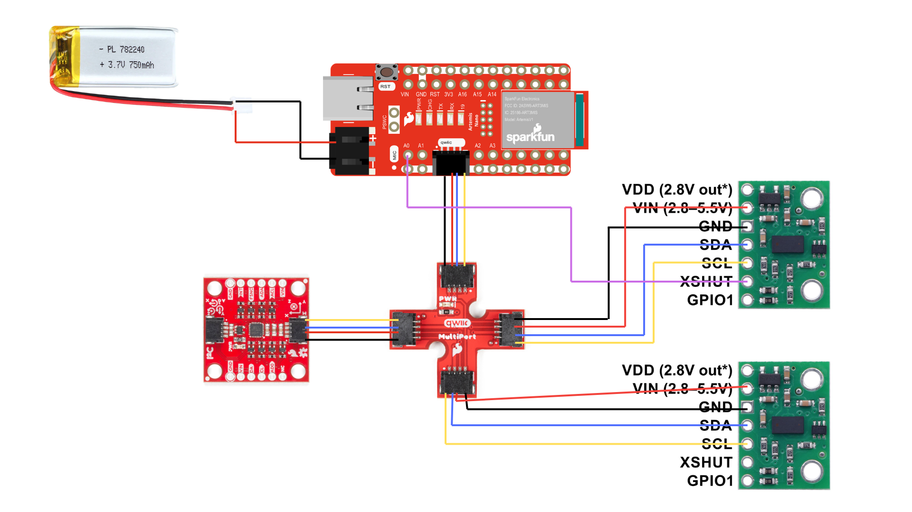

Write-up
Word limit: < 1000 words

This is not a strict requirement, but may be helpful in understanding what should be included in your webpage. It also helps with the flow of your report to show your understanding to the lab graders.

Prelab

Note the I2C sensor address

Briefly discuss the approach to using 2 ToF sensors

Briefly discuss placement of sensors on robot and scenarios where you will miss obstacles

Sketch of wiring diagram (with brief explanation if you want)

Lab Tasks

Picture of your ToF sensor connected to your QWIIC breakout board

Screenshot of Artemis scanning for I2C device (and discussion on I2C address)

Discussion and pictures of sensor data with chosen mode

2 ToF sensors and the IMU: Discussion and screenshot/video of sensors working in parallel

Tof sensor speed: Discussion on speed and limiting factor; include code snippet of how you do this

Time v Distance: Include graph of data sent over bluetooth (2 sensors)

Time v Angle: Include graph of data sent over bluetooth

(5000) Discussion on infrared transmission based sensors

(5000) Sensitivity of sensors to colors and textures

Please also include code snippets (consider using GitHub Gists) in appropriate sections if you included any written code. Do not copy and paste all your code. Include only relevant functions used for each task.

Include screenshots of relevant results.
