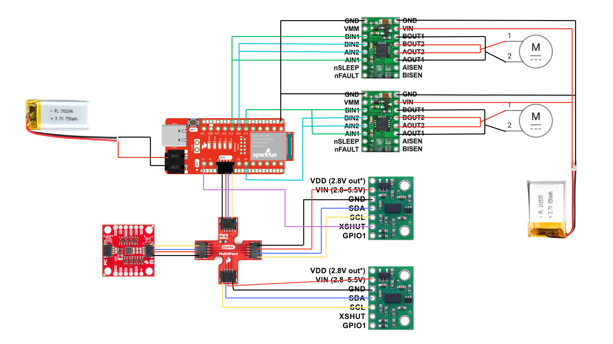
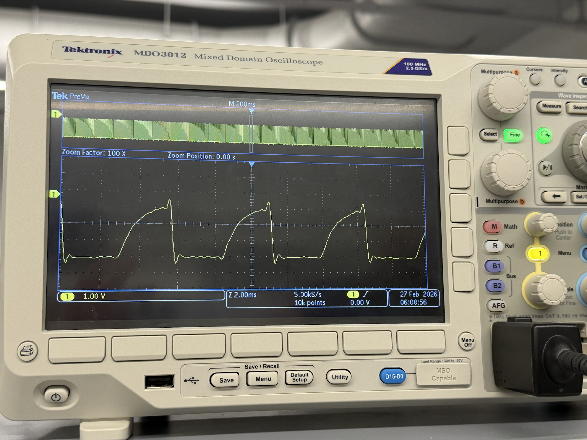
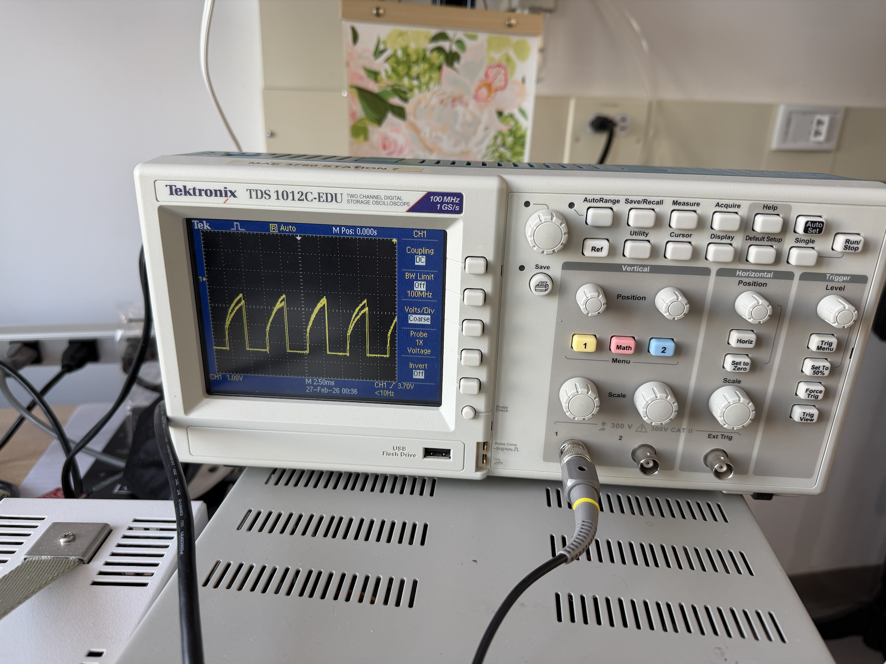
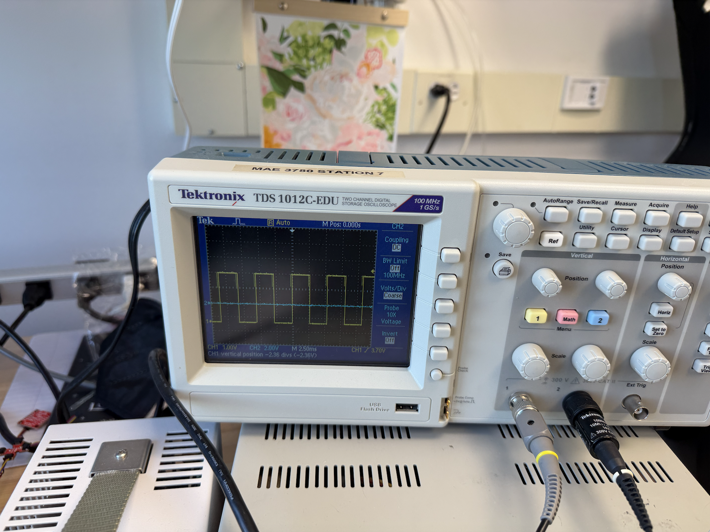
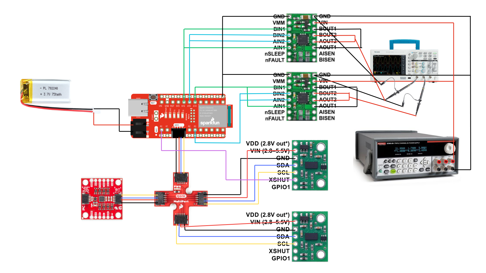
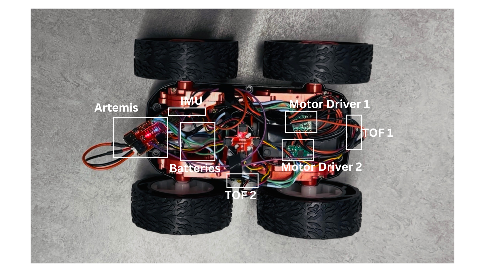
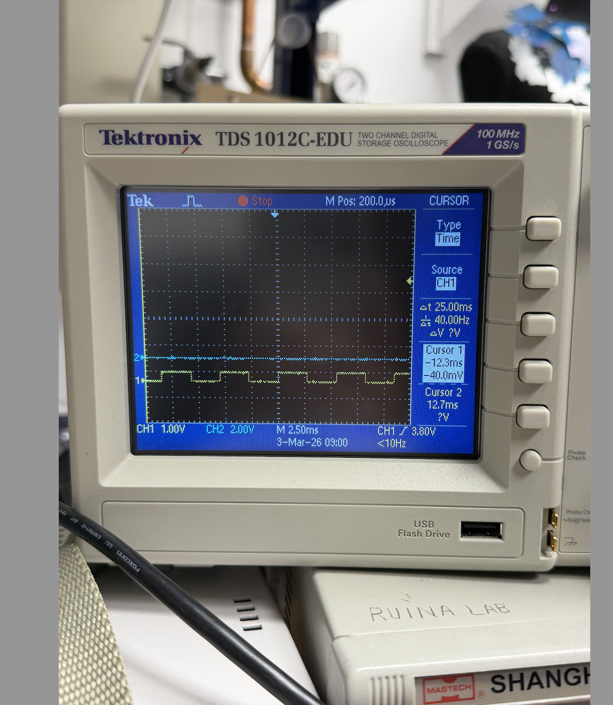

# Prelab

## Circuit Diagram

To drive the motors, I used pina A3, A14, A15, and A16 as these are PWM capable and analog. Also, these pins are conveniently placed on the opposite side of the Artemis QWIIC port so there would be minimal damage if compoenents move in the car and the pins are closer to the motors allowing for shorter wires avoiding EMI.  I followed the diagram shown in class as shown below: 



## Battery 

The Artemis and motors are powered from separate batteries. The Artemis from a 650 mAh battery and the motors from a 850mAh battery. This is important because motors draw large amounts of current when starting, which causes voltage drops on a shared power supply. If both were on the same battery, the voltage could drop below the Artemis's operational range, causes resets or BLE disconnects. Keeping them separate ensures stable operation of the microcontroller regardless of motor load. 

# Lab Tasks

I started by soldering the motor driver to the Artemis and tested it could output PWM signals. I connected an oscilloscope to the output signal of one motor driver and grounded it. I powered the driver using a 3.7volt expernal power supply, equivalent to using a battery. I sent a 50% duty cicle PWM signal for both drivers. I tested each separately and obtained the following results: 

## Oscilloscope

I obtained a chopped rising edge result instead of a perfect square wave for both drivers as follows: 



I resoldered the drivers and kept getting the same result:



Even though this is not normal PWM behavior and does not match the expected results, I continued the lab. In the end, the drivers worked just fine. 

As part of the debugging process for the chopped edge I was able to determine that this was an isolated issue regarding the motor driver and not the Artemis. The Artemis was outputting a perfect square wave as shown: 



I did not capture a photo of my bench setup before proceeding with soldering, as I was troubleshooting the chopped wave issue described below. Below is a diagram of my setup instead:



The oscilloscope probe was connected directly to the motor driver output pin, with the ground clip connected to circuit ground.

## Power Supply Setting

The external power supply was set to 3.7V to match the nominal voltage of the 850mAh LiPo battery, with a current limit arounf 1A to protect the motor drivers during initial testing. 

## Wiring to Car + Testing Motor Drivers

I removed the circuit board on the car and the attatched LEDs to it. I soldered the motor connections to the driver output pins. To test the motors, I kept using the external power supply and ran the following code that would make my wheels go forward for 5 seconds, and backwards for 5 seconds: 

````
// forward backward test
//forward
  analogWrite(3, 150);
  analogWrite(16, 150);
  analogWrite(14, 0);
  analogWrite(15, 0);
  delay(5000);
//backward
  analogWrite(14, 150);
  analogWrite(15, 150);
  analogWrite(3, 0);
  analogWrite(16, 0);
  delay(5000);
````

Here is a video of the code running: 

<iframe width="560" height="315" src="https://www.youtube.com/embed/n6jmWBIV9c4?si=LcekCE5srbo_04N4" title="YouTube video player" frameborder="0" allow="accelerometer; autoplay; clipboard-write; encrypted-media; gyroscope; picture-in-picture; web-share" referrerpolicy="strict-origin-when-cross-origin" allowfullscreen></iframe>


I also tested running the car using the 850mAh battery. I soldered the battery to the motor driver. See the following video for results: 

<iframe width="560" height="315" src="https://www.youtube.com/embed/gb6jZ4B1DHs?si=qXSFO98zxbwUQuQl" title="YouTube video player" frameborder="0" allow="accelerometer; autoplay; clipboard-write; encrypted-media; gyroscope; picture-in-picture; web-share" referrerpolicy="strict-origin-when-cross-origin" allowfullscreen></iframe>


Looking back, I made the mistake of soldering the battery directly onto the motor drivers. I did not notice the connector we were given and assumed I had to cut the existing connector of the battery. I realized my mistake when the battery depleated and my car was not working. I am hoping to get a replacement during my next lab session 🥹. 

## Components in the Car

I fixed all the components in the car with tape. The motor drivers were placed far away from the Artemis and IMU to avoid EMF interference. The ToF sensors were placed on the walls outside of the car to detect objects. As seen in the following picture, I did not secure the Artemis board yet as I kept contantly plugging it to my computer to debug and download code. 



## Lower Limit PWM Value

I tested the minimum PWM values the motors would operate under by incrementally changing the values provided to analoWrite from 0 to 255. I found that an analogWrite value of **35** was sufficient to make the car go forward and backward. This corresponds to a duty cycle of approximately 13.7%

For on-axis turns, a value of 140 was necessary to get both wheels running, although the turn was sluggish at this value. Increasing to 150 ensured the car would immediately and smoothly spin on axis. The videos below show the difference between turning at 140 and 150. 

<iframe width="560" height="315" src="https://www.youtube.com/embed/dtmJ3wMXpCQ?si=A96E5sIl4lVn0pdU" title="YouTube video player" frameborder="0" allow="accelerometer; autoplay; clipboard-write; encrypted-media; gyroscope; picture-in-picture; web-share" referrerpolicy="strict-origin-when-cross-origin" allowfullscreen></iframe>

<iframe width="560" height="315" src="https://www.youtube.com/embed/WXuU-dE0o2g?si=f0t0W6pLrWeTlHjN" title="YouTube video player" frameborder="0" allow="accelerometer; autoplay; clipboard-write; encrypted-media; gyroscope; picture-in-picture; web-share" referrerpolicy="strict-origin-when-cross-origin" allowfullscreen></iframe>

## Calibration

I found that my car veered left when both motors were driven at equal PWM values, as shown in the video below. This indicated that the left motors were spinning slower than the right, or had more resistance. 

<iframe width="560" height="315" src="https://www.youtube.com/embed/fURuT4bLCOM?si=z8tYya-WITzGq_wz" title="YouTube video player" frameborder="0" allow="accelerometer; autoplay; clipboard-write; encrypted-media; gyroscope; picture-in-picture; web-share" referrerpolicy="strict-origin-when-cross-origin" allowfullscreen></iframe>

To fix this, I applied a multiplicative calibration factor of **1.1** to the left side motors to increase their speed and match the right. I experimented with multiple values and found that 1.1 yielded the most consistent straight-line travel: 

````
  analogWrite(16, 80 * 1.1);  // adjusting bc the car veers left
  analogWrite(3, 80);
  analogWrite(15, 0);
  analogWrite(14, 0);
````

<iframe width="560" height="315" src="https://www.youtube.com/embed/uoKUZN20kVY?si=Xo2oh57Ei8kI1IJn" title="YouTube video player" frameborder="0" allow="accelerometer; autoplay; clipboard-write; encrypted-media; gyroscope; picture-in-picture; web-share" referrerpolicy="strict-origin-when-cross-origin" allowfullscreen></iframe>

## Open loop code and video
To demonstrate open loop control, I programmed the car to drive in an approximate triangle path, alternating between straight segments and turns. The code repeats three times, one straight segment followed by one turn, to complete the triangle: 

````
// straight
analogWrite(16, 80 * 1.1);  // left side scaled for calibration
analogWrite(3, 80);
analogWrite(15, 0);
analogWrite(14, 0);
delay(500);

// turn
analogWrite(16, 140 * 1.1);
analogWrite(3, 0);
analogWrite(15, 0);
analogWrite(14, 140);
delay(350);
````

The straight segments use the calibrated 1.1 factor on the left side to maintain a straight path, and the turn delay of 350ms was tuned experimentally to achieve the turns needed for a triangle. A video of this path below: 

<iframe width="560" height="315" src="https://www.youtube.com/embed/EFwjFvbf2z8?si=iFWrmB2T2yaKL5A-" title="YouTube video player" frameborder="0" allow="accelerometer; autoplay; clipboard-write; encrypted-media; gyroscope; picture-in-picture; web-share" referrerpolicy="strict-origin-when-cross-origin" allowfullscreen></iframe>

Since this is open loop cntrol, there is no feedback mechanism to correct for errors that will cause the path to deviate from a perfect triangle. Thsi is an inherent limitation of open loop ontrol and  motivated the need for closed loop feedback in the next lab.

## Note on BLE Connectivity
During testing, I encountered an issue where the BLE connection would drop whenever a motor start command was sent from Jupyter. The error received was "Not connected to a BLE device" when attempting to send a stop command immediately after starting the motors. I am still debugging this issue, but I believe it is caused by the high current draw from the motors at startup, which generates electrical noise that interferes with the BLE radio on the Artemis — even with separate batteries for the motors and Artemis.
As a workaround, I implemented a timed motor control command where the duration is sent as a parameter, allowing the car to stop itself without requiring a second BLE command.

````
case MOTOR_CONTROL:
  {
    int duration_ms;
    success = robot_cmd.get_next_value(duration_ms);
    
    analogWrite(16, 80 * 1.1);
    analogWrite(3, 80);
    analogWrite(15, 0);
    analogWrite(14, 0);

    unsigned long startTime = millis();
    while (millis() - startTime < duration_ms) {}

    motorsStop();
    break;
  }
````

## (5000) AnalogWrite Frequency

I foudn the frequency of analogWrite by writing 50% PWM to pin A2 and measuring it with an oscilloscope: 

````
void setup() {
  analogWriteResolution(8);
  analogWrite(A2, 127);  // 50% duty cycle
}
void loop() {}
````


I obtained a frequency to be about **40Hz** which is a very low frequency for motor control. At this frequency, the motors buzz audibly during operation. The motor acts as a low-pass filter and ideally should only receive the DV average voltage; at 40Hz the AC component is slow enough to influence motor behavior, causing torque ripple and less smooth operation especially at low speeds. Incorporating timers could help get a faster PWM frequency, improving low-speed control and noise. 

## (5000) Lowest PWM value speed (once in motion) discussion (include videos where appropriate)

To find the kinetic friction threshold, I tested both forward motion and on-axis turns by first jumpstarting the motors at the static threshold, then dropping to a lower value to see if motion could be sustained.

| | Static Threshold | Kinetic Threshold | Duty Cycle (Static) | Duty Cycle (Kinetic)
|--|--|--|--|--|
| **Forward** | 35 | 26 | 17.6% | 10.2% |
| **Turn** | 140 | 137 | 54.9% | 47.1% |

````
// forward
analogWrite(16, 45 * 1.1);
analogWrite(3, 45);
analogWrite(15, 0);
analogWrite(14, 0);
delay(500);  // jumpstart
analogWrite(16, 26 * 1.1);
analogWrite(3, 26);
analogWrite(15, 0);
analogWrite(14, 0);

// turn
analogWrite(16, 150 * 1.1);
analogWrite(14, 150);
analogWrite(15, 0);
analogWrite(3, 0);
delay(500);  // jumpstart
analogWrite(16, 120 * 1.1);
analogWrite(14, 120);
analogWrite(15, 0);
analogWrite(3, 0);
````
The robot settled to its slowest speed in approximately 500ms — the minimum jumpstart duration needed to overcome static friction before dropping to the kinetic threshold.

# Discussion

In this lab I learned how to interface dual motor drivers with the Artemis to achieve open loop control of the car. The most significant challenges were debugging a chopped waveform on the motor driver outputs and an unexpected BLE disconnection issue when starting the motors mid-connection, which I believe is caused by electrical noise from motor inrush current. The limitations of open loop control were clear from the triangle path test, where small inconsistencies caused visible deviation from the intended path, motivating the need for closed loop feedback in future labs.

# References 

I refered to Aidan Derocher webpage from last year to use as guidance for this lab as it's high quality was mentioned during class. I also consulted with Hayden Webb, TA Selina and Prof. Hellbling about my chopped wave problem. Hayden Webb was very kind to lend me his 850mAh battery to complete this lab. 
