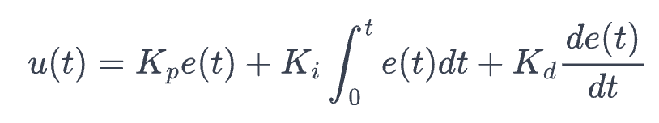
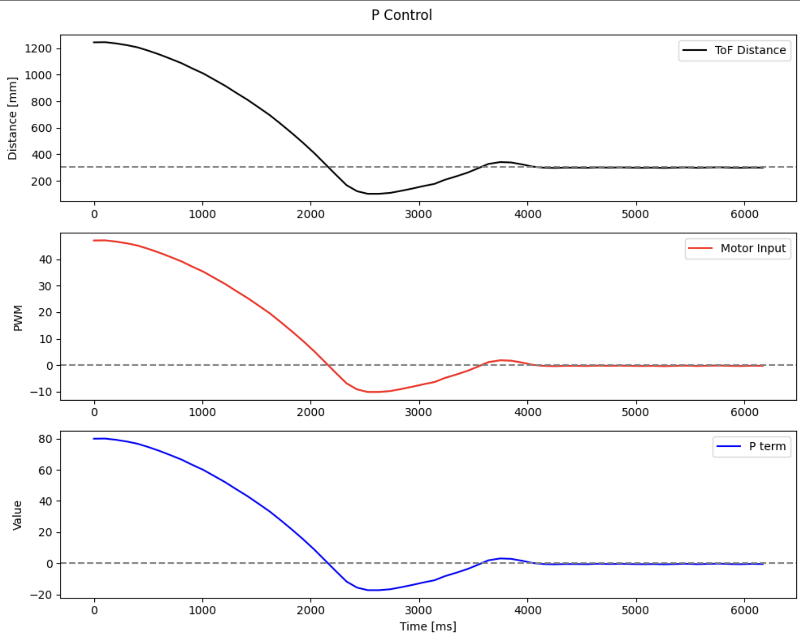
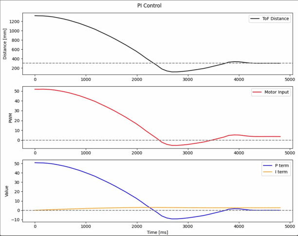
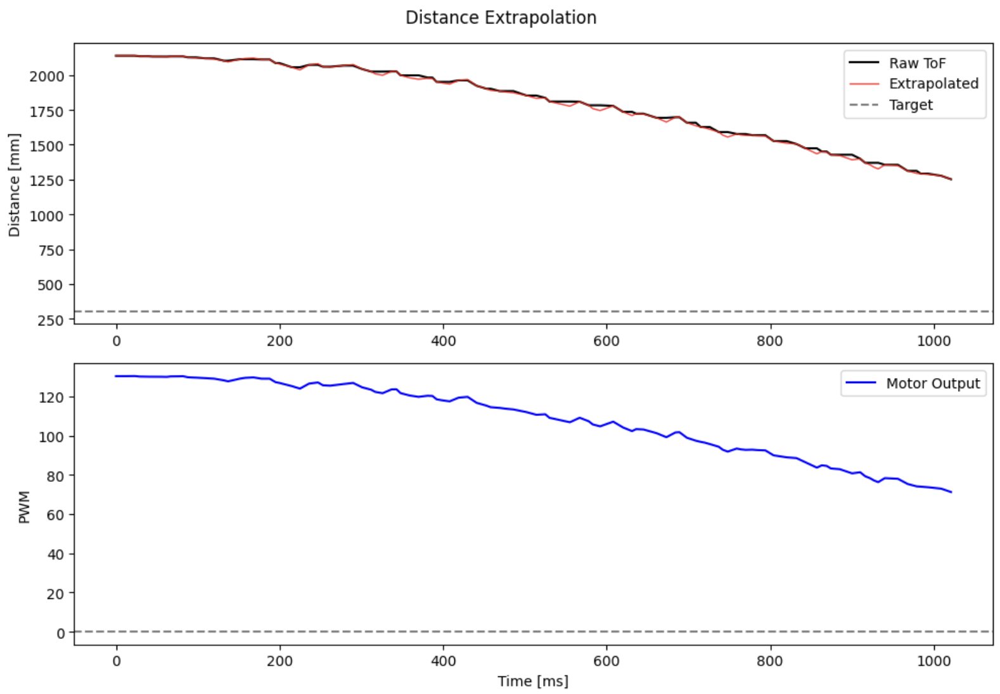
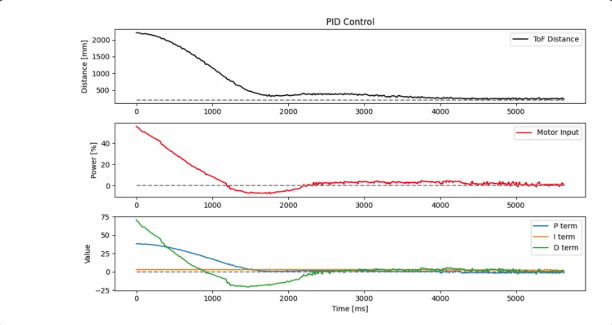
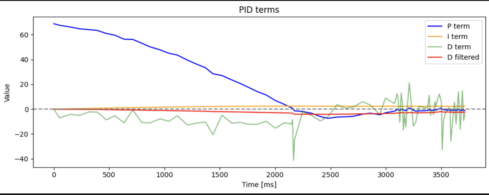
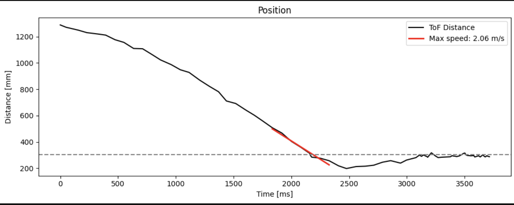

# Prelab

I implemented a BLE command system that allows me to start/stop PID control, update gains, and retrieve logged data wirelessly from Python. 

I added the following new commands to my `CommandTypes` enum:

- `SET_PID_GAINS`: sends Kp, Ki, Kd floats over BLE
- `ENABLE_MOTORS`/`DESABLE_MOTORS`: toggle motor output
- `START_PID_POS_WITH_DATA`: begins pID control and data logging with a target distance
- `STOP_PID_POS_WITH_DATA`: ends pID control and stops motors
- `SEND_PID_DATA`: transmits timestamped ToF and motor output arrays back to Python

The Python workflow works like this: 

````
ble.send_command(CMD.SET_PID_GAINS, "0.5|0.0|0.1")
ble.send_command(CMD.ENABLE_MOTORS, "")
ble.send_command(CMD.START_PID_POS_WITH_DATA, "304")  # 304mm = 1ft
# wait for maneuver
ble.send_command(CMD.STOP_PID_POS_WITH_DATA, "")
ble.send_command(CMD.SEND_PID_DATA,"")
````
PID runs non-blocking inside the main `while (central.connected())` loop, checking `checkForDataReady()` on each iteration rather than blocking with a `while(!ready) wait`. Data is stored in timestamped arrays (`pid_time_data`, `pid_tod_data`, `pid_motor_data`) and sent over BLE after the maneuver completes. 

For safety, I implemented a hard stop that triggered when BLE disconnects:

````
flag_pid_pos = false;
    flag_record_pid = false;
    motors_enabled = false;
    motorsStop();
    distanceSensor1.stopRanging();
    distanceSensor2.stopRanging();
````
This ensures the car stops if the Bluetooth connection drops mid-run. 

<iframe width="560" height="315" src="https://www.youtube.com/embed/Y9VUB1Mzq_o?si=npjEyLpQTC8yYoxI" title="YouTube video player" frameborder="0" allow="accelerometer; autoplay; clipboard-write; encrypted-media; gyroscope; picture-in-picture; web-share" referrerpolicy="strict-origin-when-cross-origin" allowfullscreen></iframe>

# Lab Tasks

## P/I/D Discussion 
My task was to drive the car from a starting distance of ~1.2m and stop it exactly 204mm (1 foot) from the wall using closed-loop PID position with a VL53L1X ToF sensor.

## Controller selection
I implemented a full PID controller. Starting with P-only control gave reasonable behavior as the car approached and settled near 304mm. However, the car had a small steady-state error that I wanted to eliminate. Adding the I term corrected this. The D term helped reduce overshoot during the fast approach. 

**Final gains:** `Kp = 0.05, Ki = 0.002, Kd = 0.005`

A speed scale factor `pid_speed_scale` multiplies the PID output before clamping, allowing testing at 50%, 80%, and 100% of full speed without changing the gains. 

**Motor deadband:** Motors stop when the error is within ±20mm of the target, preventing chatter near the setpoint. Forward motor PWM is floored at 0 (no floor needed since proportional output is already large far from the wall), and backward PWM is floored at 55 to overcome static friction. 

## Task 1: Frequency 
The ToF sampling frequency is dependent on the timing budget. Because the goal here is to make a fast PID controller that can stop the car from running into walls, I opted for a 20ms timing budget, which is the fastest supported by our ToF sensors in long mode and yields a frequency of 50 Hz. To cofirm this, I printed times to the serial monitor as fast as possible while conditionally reading ToF data, like in lab 3: 

````
if (flag_pid_pos) {
        static int pid_count = 0;
        static int tof_count_local = 0;

        // Update ToF reading only when new data is ready
        if (distanceSensor2.checkForDataReady()) {
          tof_count_local++;
          float new_dist = distanceSensor2.getDistance();
          distanceSensor2.clearInterrupt();
````
Testing revealed that the default timing bidget gave ~100ms intervals (10 Hz), which was far too slow for a responsive pID controller. After setting `setTimingBudgetInMs(20)`, the intervals dropped to ~20 ms, a 50 Hz sampling rate and a 5x improvement. 

Since the car needs to start beyond 1.3m to have room to reach full speed, short mode's range limit was also a problem. I switched to long mode, which supports up to 4m. Together with the 20ms timing budget, the sensors trade some accuracy for speed and range, which is acceptable for this task.  

## Task 2: PID Results

A PID controller combines proportional, integral, and derivative control terms to form the motor input u(t):



where e(t) is the error between the current ToF distance and the 304mm target. 

A P controller is a good starting point, however it often experiences steady-state error. A PI controller can fix this by pushing the motors harder until the error is eliminated. A PID controller improves further by damping the motor input in response to quick rapid changes in sensor readings, like when the car closes in on the wall quickly. I built up the controller incrementally, starting from P and adding terms one by one. 

### P Control
I started with the proportional term alone. The error is the difference between the current ToF reading and the 304mm setpoint. With `Kp = 0.05`, an error of ~1000mm produces an utput of 70, which is well within the 55-150PWM operating range, while an error of 50mm produces an output of 3.5, which falls below the motor threhold and causes the car to stop. This gives a natural deadband behavior near the target. 

````
float computePID(float current_dist) {
    unsigned long now = millis();
    float dt = (now - pid_prev_time) / 1000.0;
    if (dt <= 0) dt = 0.001;
    pid_prev_time = now;

    float error = current_dist - pid_pos_target;
    pid_prev_error = error;

    return (pid_Kp * error);
}
````


The car approaches and settles near 304mm with one overshoot, but a small steady-state error persists. 

<iframe width="560" height="315" src="https://www.youtube.com/embed/ls4HNULZn50?si=8LbEeg5YL69Lwf7i" title="YouTube video player" frameborder="0" allow="accelerometer; autoplay; clipboard-write; encrypted-media; gyroscope; picture-in-picture; web-share" referrerpolicy="strict-origin-when-cross-origin" allowfullscreen></iframe>

<iframe width="560" height="315" src="https://www.youtube.com/embed/5xCK_ILtfHw?si=frJFSl9arabMSrJn" title="YouTube video player" frameborder="0" allow="accelerometer; autoplay; clipboard-write; encrypted-media; gyroscope; picture-in-picture; web-share" referrerpolicy="strict-origin-when-cross-origin" allowfullscreen></iframe>

### PI Control 
To eliminate the steady-state error, I added the integral term. The integral accumulates error over time and provides a growing corrective push even when the proportional output has become very small. I kept track of `dt` between PID iterations to properly integrate

````
float error = current_dist - pid_pos_target;
pid_integral += error * dt;

float I_term = pid_Ki * pid_integral;

return (pid_Kp * error) + I_term;
````


After settling on `Ki = 0.002`, the car reliably reaches and holds 304mm. The I term is visible in the plot as a small but nonzero contribution near the setpoint that corrects the residual error left by the P term alone. 

<iframe width="560" height="315" src="https://www.youtube.com/embed/Inf_8gAk08c?si=TSrm-5DV3_BwoXE9" title="YouTube video player" frameborder="0" allow="accelerometer; autoplay; clipboard-write; encrypted-media; gyroscope; picture-in-picture; web-share" referrerpolicy="strict-origin-when-cross-origin" allowfullscreen></iframe>

### Task 3: PID Loop Rate

The VL53L1X ToF sensor was configured as follows:
````
distanceSensor2.setDistanceModeLong();
distanceSensor2.setTimingBudgetInMs(20);
distanceSensor2.setIntermeasurementPeriod(20);
````
The PID control loop, however, runs much faster than the sensor, as it is decoupled from the ToF read and runs every iteration of `loop()`. To measure the difference I added counters for both the PID iterations adn the ToF readings and printed them in the Serial Monitor: 

````
if (flag_pid_pos) {
    static int pid_count = 0;
    static int tof_count_local = 0;

    if (distanceSensor2.checkForDataReady()) {
        tof_count_local++;
        float new_dist = distanceSensor2.getDistance();
        distanceSensor2.clearInterrupt();
        // update slope...
    }

    if (tof_curr_dist > 0) {
        pid_count++;
        if (pid_count % 50 == 0) {
            Serial.print("PID count: "); Serial.print(pid_count);
            Serial.print("  TOF count: "); Serial.println(tof_count_local);
        }
        // run PID...
    }
}
````

This gave a ToF **sampling rate of ~50 Hz**. The PID control loop, however, runs at **~800 Hz** (about 16x faster than the sensor). To bridge this gap, I implemented **distance extrapolation:** between ToF readings, the controller estimates the current distance using the last measured velocity (slope):
````
float elapsed = (millis() - tof_curr_time) / 1000.0;
float extrap_dist = tof_curr_dist + tof_slope * elapsed;
````
where `tof_slope` is the velocity computed from the last two ToF readings: 

```
float dt_tof = (tof_curr_time - tof_last_time) / 1000.0;
if (dt_tof > 0) tof_slope = (tof_curr_dist - tof_last_dist) / dt_tof;
```
The extrapolated distance is fed into `computePID()` every loop interation, while `tof_slope` is updated only when a new sensor reading arrives. This decouples the control rate from the sensor rate and allows the PID loop to respond faster than the sensor can provide data.

### Task 4: Distance Extrapolation 

To extrapolate distance between ToF readings, I stored the last two measurements as globals and computed the slope between them. The extrapolated distance is then the last known position plus the slope multiplied by the time elapsed since the most recent reading: 

```
// Globals
float tof_last_dist = 0.0, tof_curr_dist = 0.0;
unsigned long tof_last_time = 0, tof_curr_time = 0;
float tof_slope = 0.0;

// Update slope when new ToF data arrives
if (distanceSensor2.checkForDataReady()) {
    tof_last_dist = tof_curr_dist;
    tof_last_time = tof_curr_time;
    tof_curr_dist = distanceSensor2.getDistance();
    distanceSensor2.clearInterrupt();
    tof_curr_time = millis();

    if (tof_last_time > 0) {
        float dt_tof = (tof_curr_time - tof_last_time) / 1000.0;
        if (dt_tof > 0) tof_slope = (tof_curr_dist - tof_last_dist) / dt_tof;
    }
}

// Extrapolate in PID loop
float elapsed = (millis() - tof_curr_time) / 1000.0;
float extrap_dist = tof_curr_dist + tof_slope * elapsed;
```

The effect of extrapolation is a relative smoothing of the step-like data generated by intermittent ToF readings. Instead of holding the last two known distance constant between readings, the controller tracks the estimated current position. The extrapolation can get its prediction wrong during sudden direction changes, causing small spikes int he extrapolated signal, but these are short-lived and don't significantly affect controller performance. 


 
## Task 5: PID Control

### PID Control 
Adding the derivative term reduced overshoot. The D term senses how quickly the error is changing. When the car is closing in on the wall, the derivative goes negative and subtracts from the motor output, effectively breaking before the car overshoots. Since the derivative of a noisy sensor signal is very spiky, I applied a low-pass filter with `alpha = 0.015`

````
float error = current_dist - pid_pos_target;
pid_integral += error * dt;
pid_integral = constrain(pid_integral, -INTEGRAL_THRESHOLD, INTEGRAL_THRESHOLD);

float derivative = (error - pid_prev_error) / dt;
pid_d_filtered = D_LPF_ALPHA * derivative + (1 - D_LPF_ALPHA) * pid_d_filtered;
pid_prev_error = error;

return (pid_Kp * error) + (pid_Ki * pid_integral) + (pid_Kd * pid_d_filtered);
````

The Full 100% speed trial from ~1260mm shows the car approaching smoothly, overshooting to ~200mm, then backing up and settling at 304mm within ~3 seconds. The D term (green) goes negative during the fast approach, as expected. The I term (orange) remains small throughout, contributing only near the setpoint. 



<iframe width="560" height="315" src="https://www.youtube.com/embed/ZxZTCUZuAlI?si=1gkkjQZqdw2AnJgD" title="YouTube video player" frameborder="0" allow="accelerometer; autoplay; clipboard-write; encrypted-media; gyroscope; picture-in-picture; web-share" referrerpolicy="strict-origin-when-cross-origin" allowfullscreen></iframe>

<iframe width="560" height="315" src="https://www.youtube.com/embed/oD6CSUUjnk4?si=QdX6vixBR66gZTsc" title="YouTube video player" frameborder="0" allow="accelerometer; autoplay; clipboard-write; encrypted-media; gyroscope; picture-in-picture; web-share" referrerpolicy="strict-origin-when-cross-origin" allowfullscreen></iframe>

<iframe width="560" height="315" src="https://www.youtube.com/embed/x4EOVGYcAVg?si=zIfw-z29mPSpSD8m" title="YouTube video player" frameborder="0" allow="accelerometer; autoplay; clipboard-write; encrypted-media; gyroscope; picture-in-picture; web-share" referrerpolicy="strict-origin-when-cross-origin" allowfullscreen></iframe>

<iframe width="560" height="315" src="https://www.youtube.com/embed/81WT8jZsVRw?si=i87h4l7g0XX-3IU3" title="YouTube video player" frameborder="0" allow="accelerometer; autoplay; clipboard-write; encrypted-media; gyroscope; picture-in-picture; web-share" referrerpolicy="strict-origin-when-cross-origin" allowfullscreen></iframe>

#### Derivative Kick
Derivative kick occurs when a sudden setpoint change causes a spike in the derivative term. In this implementation, kick is not a significant issue for two reasons:
1. The setpoint is fixed at 304mm throughout the run (no jumps)
2. The derivative is passed through a low-pass filter with alpha = 0.015, which heavily attenuates any high-frequency spikes before they affect motor output.

The plot below shows the raw (unfiltered) D term vs the filtered D term. The raw D term is noisy and spiky near the setpoint, but the filtered version remains smooth throughout. 



This shows that the LPF alone is sufficient to handle derivative kick without needing anything else. 

## Task 6: Speed
At full speed (speed scale = 1.0), the car closes a ~1.26m distance in approximately 2.2 seconds. The maximum speed during the approach is **2.06 m/s**, determined by fitting a line to the steepest portion of the distance vs. time curve. 




## (5000) Wind-Up Protection


# Discussion

# References
