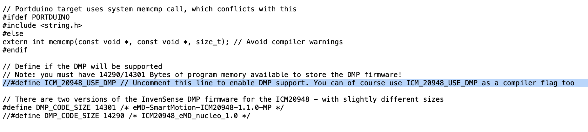
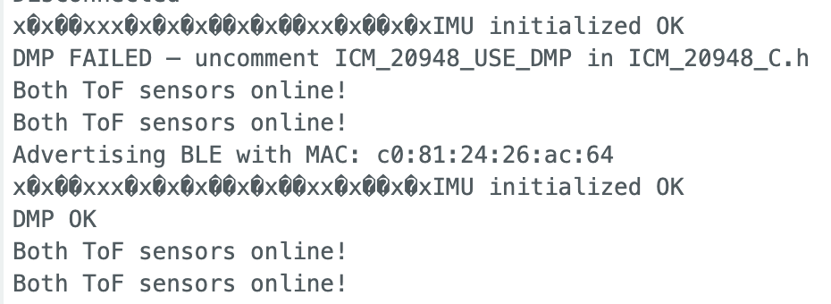
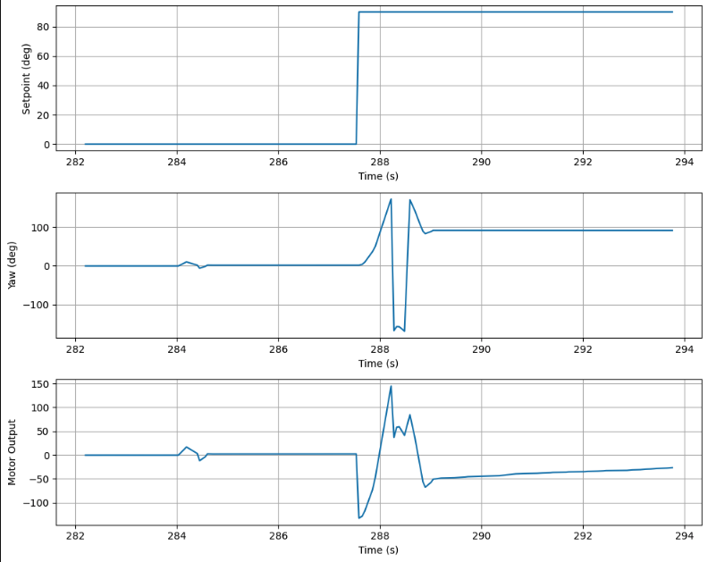

# Prelab: Bluetooth Communication

The Bluetooth communication setup from _Lab 5_ was kept, with new commands added for orientation control. The Arduino continuously polls for incoming BLE commands inside the `while(central.connected())` loop via `read_data()`, which calls `handle_command()` when a new command is received. This allows the car to receive and process commands, including **gain updates** and **setpoint changes**, while the PID controller is active. 

The new commands added for _Lab 6_ are:
- `SET_ORIENT_GAINS:` sets Kp, Ki, Kd
- `SET_SETPOINT:` updates target yaw on the fly
- `START_PID_ORIENT:` begins control and recording
- `STOP_PID_ORIENT:` stops motors and recording
- `SEND_ORIENT_DATA:` streams logged data to Python

# Lab Tasks

As done in lab 5, I will be using a PID controller. A PID controller combines proportional, integral, and derivative control terms to form the motor input u(t):


but in this case, e(t) is the error between the angular difference between the current orientation and the desired target orientation. 

## Task 1: PID Input Signal

**Gyroscope Integration**

To begin this week's lab, I needed to integrate readings from the IMU's gyroscope in order to estimate the orientation of my robot around its z-axis (yaw).

Integrating the gyroscope to estimate yaw works by accumulating `yaw += gyrZ * dt` each timestep. The main problem with this approach is gyroscope bias — even when stationary, the sensor outputs a small nonzero value that gets integrated continuously, causing the yaw estimate to drift over time.

To address this, the ICM-20948's onboard Digital Motion Processor (DMP) was used instead of raw gyro integration. The DMP fuses accelerometer and gyroscope data onboard to produce a quaternion-based orientation estimate with significantly reduced drift, which is then converted to a yaw angle in degrees for the PID input.

**Sensor Bias and Fixes**

The ICM-20948 gyroscope does exhibit bias — a small nonzero output even when the robot is stationary. This bias directly sets the rate of yaw drift: at a typical bias of ~0.3 °/s, the estimate drifts roughly 3° over 10 seconds, which is significant for a tight orientation controller. One way to correct for this manually is to sample the gyro at startup while the robot is still, average the readings, and subtract that constant offset from every future measurement. However, the cleaner solution is to use the IMU's onboard DMP, which performs continuous bias calibration, keeping drift minimal without any manual correction.

Setting up the DMP required a few extra steps to get it working:





**Sensor Limitations**

The ICM-20948 gyroscope has a maximum measurable rotational velocity of 2000 dps (degrees per second), as specified in the datasheet. This is configurable via the `GYRO_FR_FSEL` register, and when the DMP is enabled, the SparkFun library sets the full-scale range to 2000 dps by default. For this application, 2000 dps is more than sufficient — even during aggressive in-place spins, the robot is unlikely to exceed a few hundred degrees per second, leaving a large margin before the sensor saturates.

## Task 2: Derivative Term

**Does it make sense to take the derivative of a signal that is the integral of another signal?**

Yes, it actually makes sense in this case. The PID input is yaw angle, which is the integral of angular velocity (from the gyro). Taking the derivative of yaw recovers angular velocity — a clean, physically meaningful signal. So the D term is effectively just feeding back angular velocity, which is exactly what we want to dampen oscillations during a spin.

**Does changing your setpoint while the robot is running cause problems with your implementation of the PID controller?**

Derivative kick is a concern when the setpoint is changed while the controller is running. If the derivative is computed as the change in error, a sudden setpoint change causes an instantaneous jump in error, which when divided by a small dt produces a large derivative spike that kicks the motors hard. To avoid this, the derivative term should be computed on the yaw measurement directly rather than on the error, `d(yaw)/dt instead` of `d(error)/dt`. Since the yaw signal only changes when the robot actually moves, updating the setpoint mid-run only affects the P and I terms, and the D term remains smooth.

**Is a lowpass filter needed before your derivative term?**

Since the DMP already performs onboard sensor fusion, the yaw signal it outputs is significantly smoother than a raw gyro integration or ToF reading. As a result, a lowpass filter on the derivative term is less critical than in Lab 5. However, I still included it in `computeOrientPID()` as it helps reduce any residual noise in the derivative signal and prevents occasional spikes that would cause sudden motor commands: 

```c
  orient_d_filtered = D_LPF_ALPHA * derivative + (1.0 - D_LPF_ALPHA) * orient_d_filtered;
```

Where `D_LPF_ALPHA` = 0.015. 

## Task 3: Programming Implementation

The yaw signal from the DMP was sampled at approximately 20Hz (one reading every ~50ms), measured by logging timestamps whenever get_yaw() returned true. This rate is bottlenecked by the DMP's FIFO output rate, set to ~26Hz via setDMPODRrate(DMP_ODR_Reg_Quat6, 2). The usable range of the yaw signal is -180° to +180°.

**Sending and Processing:** The orientation PID runs non-blocking inside the main loop alongside `read_data()`, so BLE commands can be received and processed while the controller is active. 

**Real Time Setpoint Update:** The `SET_SETPOINT` command updates the global orient_setpoint variable directly, allowing real-time setpoint changes wihtout restarting the controller. This will be essential for hitting specific headings mid-run. 

**Forward/Backward Control:** This could be implemented by adding a base drive speed parameter to `motorsOrient()`. 

My current `motorsOrient()` looks like: 

```c
void motorsOrient(int offset) {
  int spd = constrain(abs(offset), 0, 200);
  if (spd < 10) { motorsStop(); return; }  // true zero deadband
  spd = constrain(spd, 140, 200);           // clamp to [70, 200] when moving
  if (offset > 0) {
    analogWrite(16, spd); analogWrite(15, 0);
    analogWrite(3,  0);   analogWrite(14, spd);
  } else {
    analogWrite(16, 0);   analogWrite(15, spd);
    analogWrite(3,  spd); analogWrite(14, 0);
  }
}
```

Include graphs of all appropriate measurements needed to debug your PID controller. Below is an example the set point, angle and motor offset plotted as a function of time. Observe the overshoot and settling time of the angle and the response of the motor values.

## Task 4: PID Controller 

A PID controller was implemented with final gains **Kp = 1.5, Ki = 0.02, Kd = 1.5.** Starting with P-only control, the robot convered toward the setoint bur oscillated around it. Adding the D term (Kd=1.5) damped the oscillations effectively. A small Ki=0.02 was added to address residual steady-state error, though the motor deadband (5°) already limits steady-state error in practice. A minimum PWM clamp of 140 was added in motorsOrient() to ensure the motors always overcome static friction when commanded to move.

### PID Tuning

Tuning began with P-only control:


- **Kp = 1.5, Ki = 0, Kd = 0:** Converges but still oscillates without derivative term. 


<iframe width="560" height="315" src="https://www.youtube.com/embed/EZ93HxlC1VI?si=vkrn-OFtNNs9C5b2" title="YouTube video player" frameborder="0" allow="accelerometer; autoplay; clipboard-write; encrypted-media; gyroscope; picture-in-picture; web-share" referrerpolicy="strict-origin-when-cross-origin" allowfullscreen></iframe>


- **Kp=1.5, Ki=0, Kd=0.5:** Oscillations are significantly reduced.


<iframe width="560" height="315" src="https://www.youtube.com/embed/u7PpzB268Hs?si=cnet5i-GnR2nPf0I" title="YouTube video player" frameborder="0" allow="accelerometer; autoplay; clipboard-write; encrypted-media; gyroscope; picture-in-picture; web-share" referrerpolicy="strict-origin-when-cross-origin" allowfullscreen></iframe>


- **Kp=1.5, Ki=0, Kd=1.0:** More stable.

  
<iframe width="560" height="315" src="https://www.youtube.com/embed/EsLf-Rsc5nA?si=0-pZKaDXVkfDwLa4" title="YouTube video player" frameborder="0" allow="accelerometer; autoplay; clipboard-write; encrypted-media; gyroscope; picture-in-picture; web-share" referrerpolicy="strict-origin-when-cross-origin" allowfullscreen></iframe>


- **Kp=1.5, Ki=0.02, Kd=1.5 (final):** Settles at the setpoint with minimal overshoot. A small Ki=0.02 was added to correct residual steady-state error. The final gains are Kp=1.5, Ki=0.02, Kd=1.5.


<iframe width="560" height="315" src="https://www.youtube.com/embed/ZTKOzr5Pr-I?si=O6HuzIWtvOaRwqt6" title="YouTube video player" frameborder="0" allow="accelerometer; autoplay; clipboard-write; encrypted-media; gyroscope; picture-in-picture; web-share" referrerpolicy="strict-origin-when-cross-origin" allowfullscreen></iframe>


### Setpoint Test 

**Setpoint change from 0° to 90°:** The robot holds 0°, then snaps to 90° on a live `SET_SETPOINT` command and settles cleanly. The plot below shows the full data from this run:

<iframe width="560" height="315" src="https://www.youtube.com/embed/tCKzASMDh-M?si=6L94SUdhMv88guXz" title="YouTube video player" frameborder="0" allow="accelerometer; autoplay; clipboard-write; encrypted-media; gyroscope; picture-in-picture; web-share" referrerpolicy="strict-origin-when-cross-origin" allowfullscreen></iframe>



## 5000-level Task: Integrator Windup

Implement wind-up protection for your integrator. Argue for why this is necessary (you may for example demonstrate how your controller works reasonably independent of floor surface).

Integrator wind-up occurs when the integral term accumulates unboundedly during periods where the controller output is saturated — for example, when the robot is far from its setpoint and the motors are already running at maximum speed. During this time, the error continues to be integrated even though the motor output cannot increase further. When the robot finally approaches the setpoint, the wound-up integrator produces a large overshoot because it takes time to "unwind" the accumulated integral before the output drops back into a reasonable range.
This is particularly problematic for orientation control on different floor surfaces. On a high-friction surface like carpet, the robot may be unable to move at all for several seconds while the error is large, causing the integrator to wind up significantly. When the robot is then placed on a low-friction surface, the same wound-up integrator would drive the motors far past the setpoint before the integral decays.
To prevent this, the integral term is clamped to ±200 on every timestep:

```c
cpporient_integral = constrain(orient_integral, -ORIENT_INTEGRAL_MAX, ORIENT_INTEGRAL_MAX);
```

This ensures the integrator's contribution to the motor output never exceeds a bounded value regardless of how long the robot has been away from its setpoint, making the controller's behavior more consistent across different surfaces and starting conditions.

The video below shows the controller running on carpet:

<iframe width="560" height="315" src="https://www.youtube.com/embed/_SRFOeABaU4?si=j-0YlmY8h2k61aiN" title="YouTube video player" frameborder="0" allow="accelerometer; autoplay; clipboard-write; encrypted-media; gyroscope; picture-in-picture; web-share" referrerpolicy="strict-origin-when-cross-origin" allowfullscreen></iframe>

# Discussion

This lab taught me how to implement orientation PID control using the IMU's DMP for yaw estimation. The biggest challenge was getting the DMP working correctly and the IMU had to be mounted flat for the axis mapping to work correctly (it kept unsticking). On the controls side, I learned that the sign of the PID output matters — the controller was initially diverging because positive error was spinning the robot in the wrong direction. Tuning showed that Kd was the most impactful term for stability, while Ki helped with steady-state error but required careful limiting to avoid oscillations. I also attempted to test on a sleek tiled floor, but the surface was too slippery — the robot would slip and not stop spinning in place, making consistent orientation control impossible. The tape that was suggested to reduce friction was actually counterproductive on that surface. Wind-up protection was essential to keep the integrator from accumulating during stalls, which would have caused overshoot when the robot finally started moving.

# References: 

I used Stephan Wagner's and Evan Leong's writeup as a guide for task implementation and figure/videos needed.

