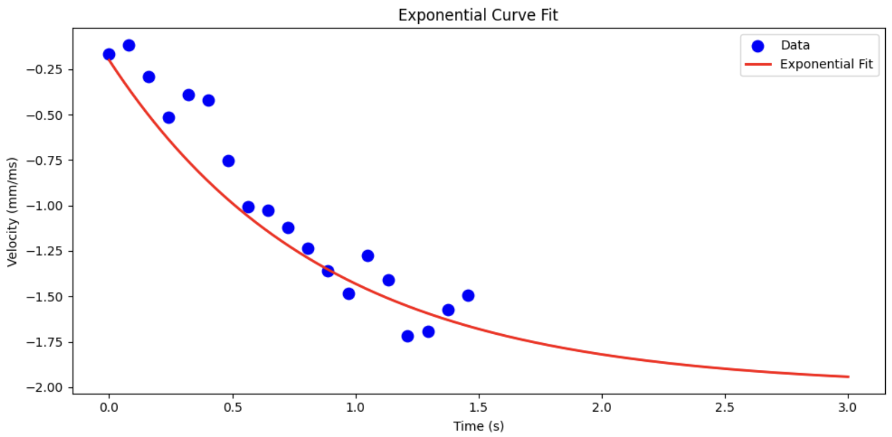
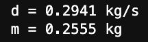
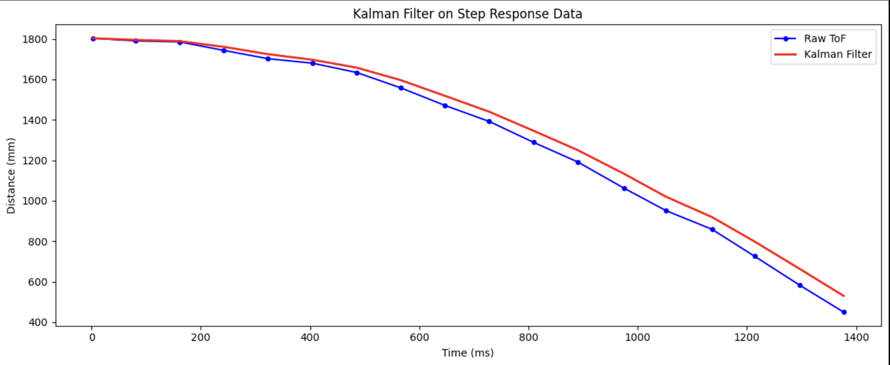
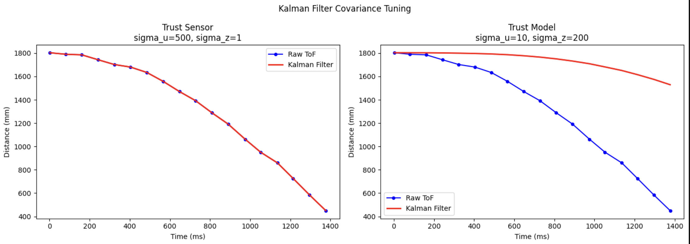
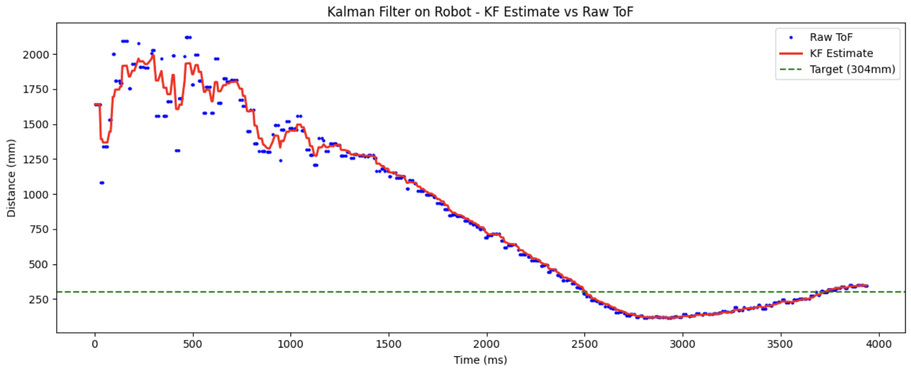
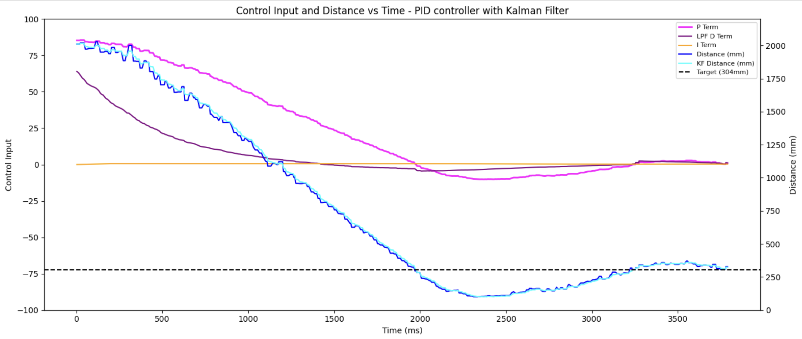

# Lab 7

## Lab Tasks 

### 1. Estimate drag and momentum

To build the state space model, I have to estimate the drag and momentum acting on my car. Following the derivation from lab, the dynamics of the system can be expressed as: 

$$
\ddot{x} = -\frac{d}{m} \dot{x} + \frac{u}{m}
$$

If we consider a step response from rest to a steady state velocity, acceleration is zero once this velocity is achieved. We can then find d and m: 

$$
d = \frac{u_{ss}}{\dot{x}_{ss}}
$$

$$
m = \frac{-d \cdot t_{0.9}}{ln(1-d \cdot \dot{x}_{ss})} = \frac{-d \cdot t_{0.9}}{ln(1-0.9)}
$$

Where d and m are lumped parameters that capture the dynamics of the system. Showing how the car responds to different inputs and moves throughout the world. I drove the car at a constant PWM = 150 (u=150/255 = 0.588) toward the wall while logging ToF distance and motor input. I chose PWM 150 to match my Lab 5 operating condition. 




Since the car did not reach steady state in a single run, I fit an exponential curve to the velocity data to extrapolate the steady-state velocity. From the fit I measured: 

- Steady-state velocity: v_ss = -2.0 mm/ms
- 90% rise time: t_90 = 2.0 s
- Velocity at 90% rise time: v_90 = -1.8 mm/ms

This gives: 




### 2. Initialize KF (Python)

The continuous-time state space matrices are: 

The state vectior is **x = [position,velocity]**. The A matrix captures the system dynamics: position changes with velocity, and velocity decays due to drag. The B matrix maps the control input to acceleration. C = [1,0] since we directly measure position from the ToF sensor. 

$$
A = \begin{bmatrix} 0 & 1 \\ 0 & -d/m \end{bmatrix} = \begin{bmatrix} 0 & 1 \\ 0 & -1.151 \end{bmatrix}
$$

$$
B = \begin{bmatrix} 0 \\ 1/m \end{bmatrix} = \begin{bmatrix} 0 \\ 3.914 \end{bmatrix}
$$

$$
C = \begin{bmatrix} 1 & 0 \end{bmatrix}
$$


I discretized at **dt = 20ms**, matching my ToF sampling rate of 50Hz from lab 5. This gives:


```c
A = np.array([[0, 1],
              [0, -d/m]])
B = np.array([[0],
              [1/m]])
C = np.array([[1, 0]])

Ad = np.eye(n) + dt * A
Bd = dt * B
```

$$
A_d = \begin{bmatrix} 1 & 0.02 \\ 0 & 0.977 \end{bmatrix}, \quad
B_d = \begin{bmatrix} 0 \\ 0.078 \end{bmatrix}
$$

The initial state vector is initialized from the first ToF reading, with velocity zero since the car starts at rest: 

$$
x_0 = \begin{bmatrix} -d_0 \\ 0 \end{bmatrix}
$$

For the covariance matrices, I set **sigma_1 = sigma_2 = 20** for process noise. For sensor noise, I set **sigma_3 = 20**, consistent with the ~20-30mm ToF standard deviation measured in lab 3. The relative values of Sigma_u and Sigma_z determine the Kalman gain. If Sigma_z is large relative to Sigma_u, the filter trusts the model more; if small, it follows the sensor closely. 

$$
\Sigma_u = \begin{bmatrix} \sigma_1^2 & 0 \\ 0 & \sigma_2^2 \end{bmatrix} = \begin{bmatrix} 400 & 0 \\ 0 & 400 \end{bmatrix}, \quad
\Sigma_z = \begin{bmatrix} \sigma_3^2 \end{bmatrix} = \begin{bmatrix} 400 \end{bmatrix}
$$


### 3. Kalman Filter in Jupyter (Python)

I tested the KF in Python on my step response data before deploying to the robot. The filter was run at the ToF sampling rate with a constant normalized input u = 150/255 = 0.588. In the prediction step, it uses the dynamics model to estimate the next state, and in the update step it merges this prediction with the new ToF measurement weighted by the Kalman gain: 

In Python, I implemented: 
```c
def kf(mu, sigma, u, y, update=True):
    mu_p    = Ad.dot(mu) + Bd.dot(u)
    sigma_p = Ad.dot(sigma.dot(Ad.T)) + Sigma_u
    if not update:
        return mu_p, sigma_p
    sigma_m  = C.dot(sigma_p.dot(C.T)) + Sigma_z
    kf_gain  = sigma_p.dot(C.T.dot(np.linalg.inv(sigma_m)))
    y_m      = y - C.dot(mu_p)
    mu       = mu_p + kf_gain.dot(y_m)
    sigma    = (np.eye(2) - kf_gain.dot(C)).dot(sigma_p)
    return mu, sigma
```



The filter tracks the raw ToF well, with a small lag in the later portion of the run. The model preducts slightly slower deceleration. However, this is expected given the uncertainty in d and m. 

#### Parameter Discussion 
Tuning the covariance matrices shows a clear trafeoff. When sigma_z is small (high sensor trust), the KF output closely trakced the raw ToF with minimal smoothing. When sigma_z is large (high model trust), the KF ignores sensor updates and relies entirely on the dynamics model, causing it to diverge from the true distance. 

In the left plot (sigma_u = 500, sigma_z = 1), the filter trusts the sensor almost completely — the KF output overlaps with the raw ToF since the Kalman gain approaches 1 and the model contributes nothing. In the right plot (sigma_u = 10, sigma_z = 200), the filter trusts the model heavily — it barely responds to sensor updates and lags far behind the true distance. For my final implementation I used sigma_1 = sigma_2 = 20, sigma_3 = 50, which balances both sources and produces a smooth estimate that tracks the true distance while rejecting noise.



### 4.  Kalman Filter on the Robot

I removed the linear extrapolation from lab 5 and added the Kalman Filter running directly on the Artemis using the BasicLinearAlgebra library. All KF parameters (PID gains, d, m, sigma values) are sent over BLE from Python.

The KF runs every loop iteration, predicting the next state using the physics model. It only performs a measurement updaye when a new ToF reading is available. This allows the PID controller to run at the full loop rate (~800Hz) using KF estimates between sensor readings, rather than being limited to the 50Hz ToF rate. 

In the early portion of the run (0-800ms), the raw ToF readings show significant noise due to the 20ms timing budget at long range. Only once the car closes within ~1.5m, the ToF stabilizes and KF tracks closely, sucessfully guiding the car to stop at the 304mm target. 



```c
void kalman_step(float u, float y, bool update) {
  // predict
  Matrix<2, 1> mu_p = Ad_kf * x_kf + Bd_kf * u;
  Matrix<2, 2> sigma_p = Ad_kf * Sigma_kf * ~Ad_kf + Sigma_u_kf;

  if (!update) {
    x_kf = mu_p;
    Sigma_kf = sigma_p;
    return;
  }

  // update
  Matrix<1, 1> sigma_m = C_kf * sigma_p * ~C_kf + Sigma_z_kf;
  Matrix<2, 1> kf_gain = sigma_p * ~C_kf * Inverse(sigma_m);

  Matrix<1, 1> y_m;
  y_m(0) = y - (C_kf * mu_p)(0);

  x_kf = mu_p + kf_gain * y_m;
  Matrix<2, 2> I_KC = { 1 - kf_gain(0) * C_kf(0, 0), -kf_gain(0) * C_kf(0, 1),
                        -kf_gain(1) * C_kf(0, 0), 1 - kf_gain(1) * C_kf(0, 1) };
  Sigma_kf = I_KC * sigma_p;
}
```

I implemented a new case `START_KF_PID` which receives all tunable parameters: 

```c
while (millis() - start_time < (unsigned long)runtime) {

          // check for new ToF data
          bool got_new_tof = false;
          if (distanceSensor2.checkForDataReady()) {
            kf_last_tof = distanceSensor2.getDistance();
            distanceSensor2.clearInterrupt();
            got_new_tof = true;
          }

          // run KF step. update only when new ToF data arrived
          float u = pid_motor_data[max(0, kf_data_index - 1)] / 255.0;
          kalman_step(u, kf_last_tof, got_new_tof);

          // get KF position estimate
          float kf_dist = x_kf(0);

          // compute PID on KF estimate
          float error = kf_dist - pid_pos_target;
          float output = computePID(kf_dist);
          output = constrain(output, -255, 255);

          // drive motors
          if (abs(error) < DEADBAND_MM) {
            motorsStop();
          } else if (error > 0) {
            motorsForward((int)constrain(abs(output), 55, 150));
          } else {
            motorsBackward((int)constrain(abs(output), 55, 150));
          }
}
```

<iframe width="560" height="315" src="https://www.youtube.com/embed/cPGe_ZuRw64?si=p2HoFTTKNWN0gFh5" title="YouTube video player" frameborder="0" allow="accelerometer; autoplay; clipboard-write; encrypted-media; gyroscope; picture-in-picture; web-share" referrerpolicy="strict-origin-when-cross-origin" allowfullscreen></iframe>


The P term (magenta) starts high when the car is far from the wall and decreases as it approaches, going negative briefly when the car overshoots before settling near zero at the target. The D term (purple) is negative during the fast approach as it resists the rapid change in error, then crosses zero as the car decelerates. The I term (orange) remains small throughout since the KF provides a clean enough estimate to keep steady-state error low.





## Discussion 

Compared to Lab 5, replacing linear extrapolation with the Kalman Filter produces a smoother distance estimate, especially visible in the noisy early region where the raw ToF jumps significantly but the KF remains more stable. This smoother input to the PID controller contributes to a cleaner stop at the 304mm target.
One practical challenge during testing was BLE disconnection. If the car hit the wall too hard or missed the foam padding entirely, the physical impact would jar the board and drop the BLE connection, causing all logged data in RAM to be lost. Adding extra padding to the wall helped absorb the impact and keep the connection stable during runs.

## References
I used Trevor Dales's writeup as a guide for task implementation and figure/videos needed. Claude helped make the plots prettier and cleaner. 


