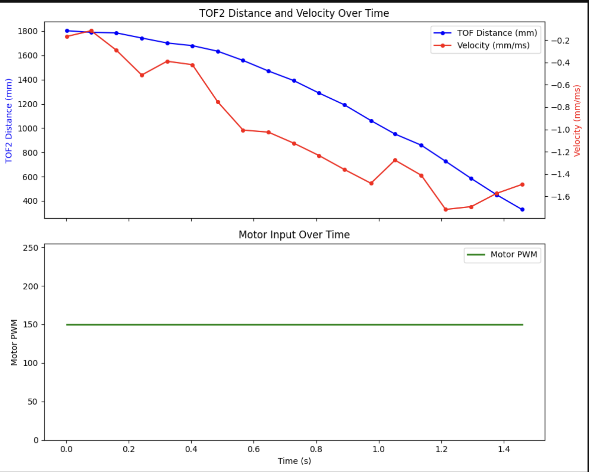
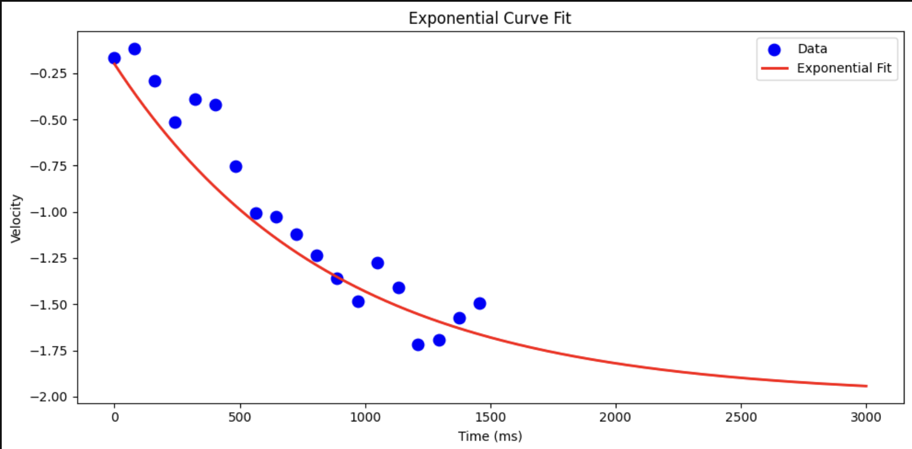

# Lab 7

## Lab Tasks 

### 1. Estimate drag and momentum

to build the state space model, I have to estimate the drag and momentum acting on my car. Following the derivation from lab, the dynamics of the system can be expressed as: 

$$
\ddot{x} = -\frac{d}{m} \dot{x} + \frac{u}{m}
$$

If we consider a step response from rest to a steady state velocity, acceleration is zero once this velocity is achieved. We can then find d and m: 

$$
d = \frac{u_{ss}}{\dot{x}_{ss}}
$$

$$
m = \frac{-d \cdot t_{0.9}}{ln(1-d \cdot \dot{x}_{ss})} = \frac{-d \cdot t_{0.9}}{ln(1-0.9)}
$$

Where d and m are lumped parameters that capture the dynamics of the system. Showing how the car responds to different inouts and moves throughout the world. 

$u_{ss}$ is the constant control input passed to the robot. We will choose this input to be 1, as this corresponds to the maximum pwm signal possible (255). This is because we want the dybnamics to be as accurate as possible in order to obtain ideal behavior of an accurate controller. 


**To build the state space model for your system, you will need to estimate the drag and momentum terms for your A and B matrices. Here, we will do this using a step response. Drive the car towards a wall at a constant imput motor speed while logging motor input values and ToF sensor output.**

**- Drag terms for A matrix:**
**- Drag terms for B matrix: **

Choose your step responce, u(t), to be of similar size to the PWM value you used in Lab 5 (to keep the dynamics similar). Pick something between 50%-100% of the maximum u.

Make sure your step time is long enough to reach steady state (you likely have to use active braking of the car to avoid crashing into the wall). Make sure to use a piece of foam to avoid hitting the wall and damaging your car.

Show graphs for the TOF sensor output, the (computed) speed, and the motor input. Please ensure that the x-axis is in seconds.

Measure the steady state speed, 90% rise time, and the speed at 90% risetime. Note, this doesn’t have to be 90%, you could also use somewhere between 60-90, but the speed and time must correspond to get an accurate estimate for m.

When sending this data back to your laptop, make sure to save the data in a file so that you can use it even after your Jupyter kernel restarts. Consider writing the data to a CSV file, pickle file, or shelve file.





I chose a step input of PWm = 150, matching my Lab 5 operating condition. From the exponentil curve fit, I measured: 

- Steady-state velocity: v_ss = -2.0 mm/ms
- 90% rise time: t_90 = 2.0 s
- Velocity at 90% rise time: v_90 = -1.8 mm/ms

This gives: 


**2. Initialize KF (Python)**

Compute the A and B matrix given the terms you found above, and discretize your matrices. Be sure to note the sampling time in your write-up.

Ad = np.eye(n) + Delta_T * A  //n is the dimension of your state space 
Bd = Delta_t * B
Identify your C matrix. Recall that C is a m x n matrix, where n are the dimensions in your state space, and m are the number of states you actually measure.
This could look like C=np.array([[-1,0]]), because you measure the negative distance from the wall (state 0).
Initialize your state vector, x, e.g. like this: x = np.array([[-TOF[0]],[0]])


The continuous-time state space matrices are: 

The state vectior is x = [position,velocity]. The A matrix captures the system dynamics: position changes with velocity, and velocity decays due to drag. The B matrix maps the control input to acceleration. C = [1,0] since we directly measure position from the ToF sensor. 
I discretized at **dt = 20ms**, matching my ToF sampling rate of 50Hz from lab 5. This gives:

$$
x_0 = \begin{bmatrix} -d_0 \\ 0 \end{bmatrix}
$$

$$
A = \begin{bmatrix} 0 & 1 \\ 0 & -d/m \end{bmatrix} = \begin{bmatrix} 0 & 1 \\ 0 & -1.151 \end{bmatrix}
$$

$$
B = \begin{bmatrix} 0 \\ 1/m \end{bmatrix} = \begin{bmatrix} 0 \\ 3.914 \end{bmatrix}
$$

$$
C = \begin{bmatrix} 1 & 0 \end{bmatrix}
$$

```c
A = np.array([[0, 1],
              [0, -d/m]])
B = np.array([[0],
              [1/m]])
C = np.array([[1, 0]])

Ad = np.eye(n) + dt * A
Bd = dt * B
```

For the covariance matrices, I set **sigma_1 = sigma_2 = 20** for process noise. For sensor noise, I set **sigma_3 = 20**, consistent with the ~20-30mm ToF standard deviation measured in lab 3. The relative values of Sigma_u and Sigma_z determine the Kalman gain. If Sigma_z is large relative to Sigma_u, the filter trusts the model more; if small, it follows the sensor closely. 

$$
\Sigma_u = \begin{bmatrix} \sigma_1^2 & 0 \\ 0 & \sigma_2^2 \end{bmatrix} = \begin{bmatrix} 400 & 0 \\ 0 & 400 \end{bmatrix}, \quad
\Sigma_z = \begin{bmatrix} \sigma_3^2 \end{bmatrix} = \begin{bmatrix} 400 \end{bmatrix}
$$

For the Kalman Filter to work well, you will need to specify your process noise and sensor noise covariance matrices.
Try to reason about ballpark numbers for the variance of each state variable and sensor input.
Recall that their relative values determine how much you trust your model versus your sensor measurements. If the values are set too small, the Kalman Filter will not work, if the values are too big, it will barely respond.
Recall that the covariance matrices take the approximate following form, depending on the dimension of your system state space and the sensor inputs.
sig_u=np.array([[sigma_1**2,0],[0,sigma_2**2]]) //We assume uncorrelated noise, and therefore a diagonal matrix works.
sig_z=np.array([[sigma_3**2]])


3. Implement and test your Kalman Filter in Jupyter (Python)
To sanity check your parameters, implement your Kalman Filter in Jupyter first. You can do this using the function in the code below (for ease, variable names follow the convention from the lecture slides).
Import timing, ToF, and PWM data from a straight run towards the wall (you should have this data handy from lab 5).
You may need to format your data first. For the Kalman Filter to work, you’ll need all input arrays to be of equal length. That means that you might have to interpolate data if for example you have fewer ToF measurements than you have motor input updates. This should also be handy from lab 5.
Loop through all of the data, while calling the Kalman Filter.
Remember to scale your input from 1 to the actual value of your step size (u/step_size).
Plot the Kalman Filter output to demonstrate how well your Kalman Filter estimated the system state.
If your Kalman Filter is off, try adjusting the covariance matrices. Discuss how/why you adjust them.
Be sure to include a discussion of all the paramters that affect the performace of your filter.
def kf(mu,sigma,u,y):
    
    mu_p = A.dot(mu) + B.dot(u) 
    sigma_p = A.dot(sigma.dot(A.transpose())) + Sigma_u
    
    sigma_m = C.dot(sigma_p.dot(C.transpose())) + Sigma_z
    kkf_gain = sigma_p.dot(C.transpose().dot(np.linalg.inv(sigma_m)))

    y_m = y-C.dot(mu_p)
    mu = mu_p + kkf_gain.dot(y_m)    
    sigma=(np.eye(2)-kkf_gain.dot(C)).dot(sigma_p)

    return mu,sigma

I tested the KF in Python on my step response data before deploying to the robot. The filter was run at the ToF sampling rate with a constant normalized input u = 150/255. 
Tuning the covariance matrices shows a clear trafeoff. When sigma_z is small (high sensor trust), the KF output closely trakced the raw ToF with minimal smoothing. When sigma_z is large (high model trust), the KF ignores sensor updates and relies entirely on the dynamics model, causing it to diverge from the true distance. 

In Python, I implemented: 
```c
def kf(mu, sigma, u, y, update=True):
    mu_p    = Ad.dot(mu) + Bd.dot(u)
    sigma_p = Ad.dot(sigma.dot(Ad.T)) + Sigma_u
    if not update:
        return mu_p, sigma_p
    sigma_m  = C.dot(sigma_p.dot(C.T)) + Sigma_z
    kf_gain  = sigma_p.dot(C.T.dot(np.linalg.inv(sigma_m)))
    y_m      = y - C.dot(mu_p)
    mu       = mu_p + kf_gain.dot(y_m)
    sigma    = (np.eye(2) - kf_gain.dot(C)).dot(sigma_p)
    return mu, sigma
```


4. Implement the Kalman Filter on the Robot
Integrate the Kalman Filter into your Lab 5 PID solution on the Artemis. Before trying to increase the speed of your controller, use your debugging script to verify that your Kalman Filter works as expected. Make sure to remove the linear extrapolation step before doing this. Be sure to demonstrate that your solution works by uploading videos and by plotting corresponding raw and estimated data in the same graph.

The following code snippets give helpful hints on how to do matrix operations on the robot:

#include <BasicLinearAlgebra.h>    //Use this library to work with matrices:
using namespace BLA;               //This allows you to declare a matrix

Matrix<2,1> state = {0,0};         //Declares and initializes a 2x1 matrix 
Matrix<1> u;                       //Basically a float that plays nice with the matrix operators
Matrix<2,2> A = {1, 1,
                 0, 1};            //Declares and initializes a 2x2 matrix
state(1,0) = 1;                    //Writes only location 1 in the 2x1 matrix.
Sigma_p = Ad*Sigma*~Ad + Sigma_u;  //Example of how to compute Sigma_p (~Ad equals Ad transposed) 

I replaced the linear extrapolation from lab 5 with the Kalman Filter running directly on the Artemis using the BasicLinearAlgebra library. All KF parameters (PID gains, d, m, sigma values) are sent over BLE from Python.

The KF runs every loop iteration, predicting the next state using the physics model. It only performs a measurement updaye when a new ToF reading is available. This allows the pID controller to run at the full loop rate (~800Hz) using KF estimates between sensor readings, rather than being limited to the 50Hz ToF rate. 

In the early portion of the run (0-800ms), the raw ToF readings exhibit significant noise due to the 20ms timing budget at lonf range. Only once the car closes within ~1.5m, the ToF stabilizes and KF tracks closely, sucessfully guiding the car to stop at the 304mm target. 

```c
void kalman_step(float u, float y, bool update) {
  // Predict
  Matrix<2, 1> mu_p = Ad_kf * x_kf + Bd_kf * u;
  Matrix<2, 2> sigma_p = Ad_kf * Sigma_kf * ~Ad_kf + Sigma_u_kf;

  if (!update) {
    x_kf = mu_p;
    Sigma_kf = sigma_p;
    return;
  }

  // Update
  Matrix<1, 1> sigma_m = C_kf * sigma_p * ~C_kf + Sigma_z_kf;
  Matrix<2, 1> kf_gain = sigma_p * ~C_kf * Inverse(sigma_m);

  Matrix<1, 1> y_m;
  y_m(0) = y - (C_kf * mu_p)(0);

  x_kf = mu_p + kf_gain * y_m;
  Matrix<2, 2> I_KC = { 1 - kf_gain(0) * C_kf(0, 0), -kf_gain(0) * C_kf(0, 1),
                        -kf_gain(1) * C_kf(0, 0), 1 - kf_gain(1) * C_kf(0, 1) };
  Sigma_kf = I_KC * sigma_p;
}
```


```c
while (millis() - start_time < (unsigned long)runtime) {

          // Check for new ToF data
          bool got_new_tof = false;
          if (distanceSensor2.checkForDataReady()) {
            kf_last_tof = distanceSensor2.getDistance();
            distanceSensor2.clearInterrupt();
            got_new_tof = true;
          }

          // Run KF step — update only when new ToF data arrived
          float u = pid_motor_data[max(0, kf_data_index - 1)] / 255.0;
          kalman_step(u, kf_last_tof, got_new_tof);

          // Get KF position estimate
          float kf_dist = x_kf(0);

          // Compute PID on KF estimate
          float error = kf_dist - pid_pos_target;
          float output = computePID(kf_dist);
          output = constrain(output, -255, 255);

          // Drive motors
          if (abs(error) < DEADBAND_MM) {
            motorsStop();
          } else if (error > 0) {
            motorsForward((int)constrain(abs(output), 55, 150));
          } else {
            motorsBackward((int)constrain(abs(output), 55, 150));
          }
}
```

5. Speed it up (optional)
If you have time, and want to get a jump start on Lab 8, try speeding up your robot with your KF to decrease the execution time of your control loop. Note: you built your Kalman Filter around a specific setpoint u, if you speed up your robot, you will want to check that your model is still valid at the higher higher operating condition.


