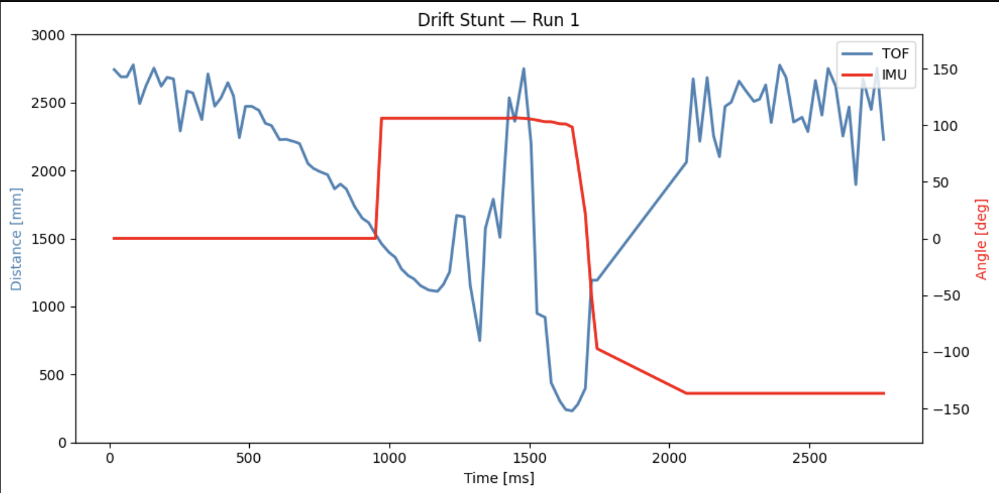

# Lab 8: Stunts - Drift

## Overview

The robot starts about 4 meters from the wall, drives forward using linear PID control. and initiates a 180° orientation-PID-controlled spin when it is about a meter from the wall, before returning past the starting line. 

## Design

My initial plan was to use the Kalman Filter from Lab 7 suring the appproach phase for faster distance estimation and drive at full raw PWM. However, several design decisions changed during implementation: 

- I did not use KF: the KF parameters (d,m) were determined using PWM 150 during Lab 7. At PWM 190, the model was worng and so the KF estimate diverged. I opted for using raw ToF.
- Linear PID replaced raw PWM: using full speed caused the car to crash into the wall before triggering. Linear PID from Lab 5 was a more reliable approach
- Orientation settling dropped: waiting for the orient PID to settle at 180° was unreiable. Instead, STATE 3 exists as soon as the yaw has changed by 120° from the starting angle. 

The drift runs inside `drift_step()`, called in every iteration of the main `loop()`:

- STATE 0 - initialize: capture starting yaw, reset all PID state, enable linear PID
- STATE 1 - approach: linear pID drives toward wall, triggers when ToF < 1500 mm
- STATE 2 - setup spin: compute `yaw_start + 180°` target wth angle wrapping, enable orientation PID.
- STATE 3 - spin: exisys wjen yaw has changed ≥ 120° from start
- STATE 4 - return: motorsForward(200) for 1 seconds

```c
void drift_step() {
  if (!drift_active) return;
  unsigned long now = millis();

  // STATE 0: initialize
  if (drift_state_num == 0) {
    yaw_start = global_yaw;
    if (tof_curr_dist <= 0) return;
    pid_pos_target = drift_trigger_dist;
    flag_pid_pos = true;
    drift_state_num = 1;
    drift_state_start = now;
  }
  // STATE 1: approach
  else if (drift_state_num == 1) {
    if (dist > 0 && dist <= drift_trigger_dist) {
      flag_pid_pos = false;
      motorsStop();
      drift_state_num = 2;
    }
  }
  // STATE 2: setup spin
  else if (drift_state_num == 2) {
    float target_yaw = yaw_start + 180.0;
    if (target_yaw > 180.0) target_yaw -= 360.0;
    if (target_yaw < -180.0) target_yaw += 360.0;
    orient_setpoint = target_yaw;
    flag_pid_orient = true;
    drift_state_num = 3;
  }
  // STATE 3: spin exit on yaw change threshold
  else if (drift_state_num == 3) {
    if (now - drift_state_start < 300) return;
    float yaw_change = global_yaw - yaw_start;
    while (yaw_change > 180.0)  yaw_change -= 360.0;
    while (yaw_change < -180.0) yaw_change += 360.0;
    if (fabs(yaw_change) >= 120.0) {
      flag_pid_orient = false;
      motorsStop();
      delay(300);
      drift_return_start_time = millis();
      drift_state_num = 4;
    }
  }
  // STATE 4: return
  else if (drift_state_num == 4) {
    flag_pid_orient = false;
    motorsForward(150);
    if (millis() - drift_return_start_time > 1000) {
      motorsStop();
      drift_active = false;
    }
  }
}
```
### The Return Phase

After the 180° spin, the ToF sensor faces away from the wall and cannot measure return distance. I used a timed `motorsForward()` call at 200 PWM for 1 second. 

### PID Gains

- Linear PID: Kp = 0.05, Ki = 0.002, Kd = 0.005
- Orientation PID: Kp = 5.0, Ki = 0, Kd = 0

## Debugging Issues 

This lab was supposed to be quick and easy and I spent countless hours debugging the following issues: 

1. **Car crashing into wall:** the ToF was mounted slightly downward, and it was reading the floor. This meant the trigger condition fired immediately regardless of wall distance, causing the car to jump straight to STATE 3 (spin) without approaching.
2. **Orient PID gains:** with `Kp = 0.5`, the PID output was only `0.05 * 180 = 9`, below the minimum threshold in `motorsOrient()`. The car never spun, it would just stop 3 feet from the wall. Raisin Kp to XXXXXX fixed this.
3. **Inconsistent wheel friction during tuning:** the linear PID was tuned without tape on the wheels, but the orientation PID was initially tuned with tape on the wheels to try to make the spin more controlled. This created a mismatch — the tape drastically reduced friction, making the car spin uncontrollably and overshoot far past 180°. Parameters that worked with tape caused completely different behavior without it, making it extremely difficult to find gains that worked consistently. Removing the tape entirely and retuning the orientation PID from scratch resolved this.
4. **Multiple overlapping data traces:** drift_state_start was resetting between states, causing timestamps to restart mid-run and producing multiple apparent "runs" in a single plot. Fixed by setting drift_state_start only once in STATE 0 and using a separate drift_return_start_time for STATE 4.

## Results 

<iframe width="560" height="315" src="https://www.youtube.com/embed/EpEb1Za8rkI?si=wa-x9cIBpXh2obMF" title="YouTube video player" frameborder="0" allow="accelerometer; autoplay; clipboard-write; encrypted-media; gyroscope; picture-in-picture; web-share" referrerpolicy="strict-origin-when-cross-origin" allowfullscreen></iframe>



The plot shows the complete stunt sequence: ToF decreasing from ~2700mm to 1500mm during approach (0–1000ms), wild ToF readings as the sensor rotates during the spin (1000–1700ms), IMU yaw changing by ~140° confirming the rotation, then ToF increasing as the car returns away from the wall (1700ms+).

## Just for fun

<iframe width="560" height="315" src="https://www.youtube.com/embed/zaOLfMlM2To?si=oelBLh3DZBruoQw8" title="YouTube video player" frameborder="0" allow="accelerometer; autoplay; clipboard-write; encrypted-media; gyroscope; picture-in-picture; web-share" referrerpolicy="strict-origin-when-cross-origin" allowfullscreen></iframe>

## Conclusion

The drift stunt succesfully demonstrates combined use of linear PID, orientation PID, and ToF sensing. The main challenges were managing DMP FIFO reads, tuning the trigger distance for high-speed spproach, and maintaining BLE connectivity during the stunt. 
Also, while writing this report I won the NSF GRFP grant so now I'm done right on time to celebrate 🎊. 

## References

I used Andrew DOnofrio's page for code reference. I used Claude when I could not figure out why my car kept spinning uncontrollably to return. This did not help much though. 
