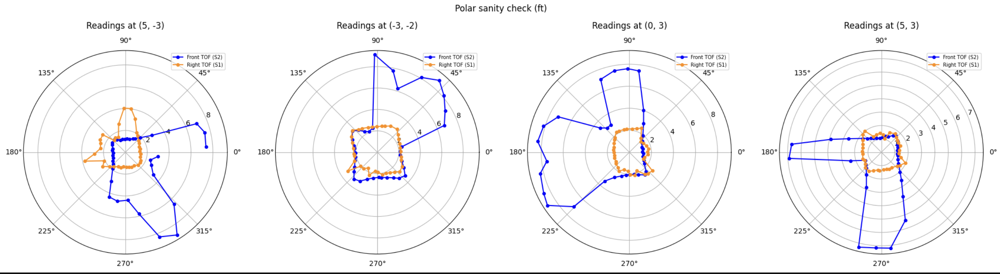
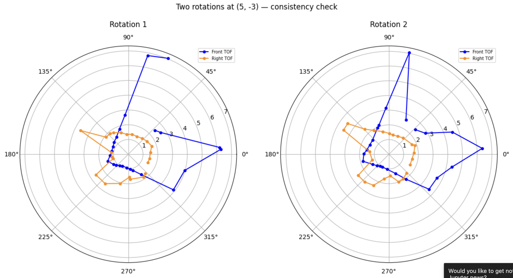
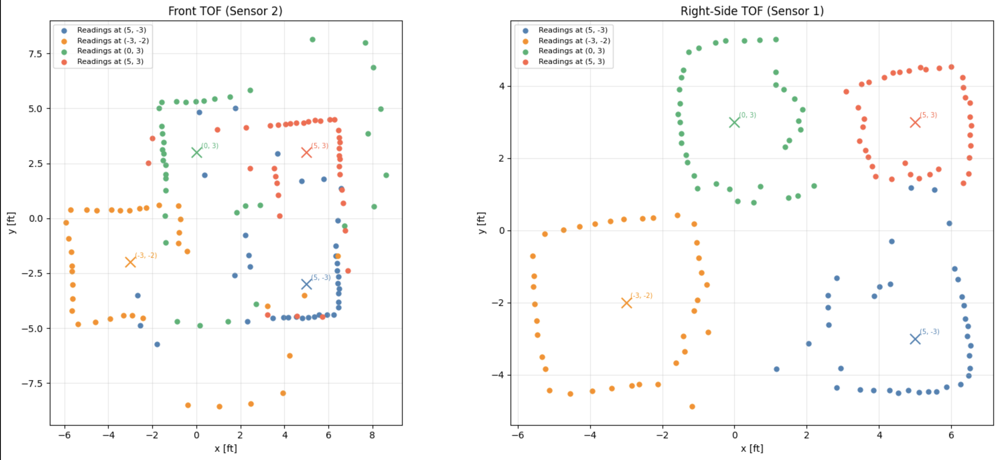
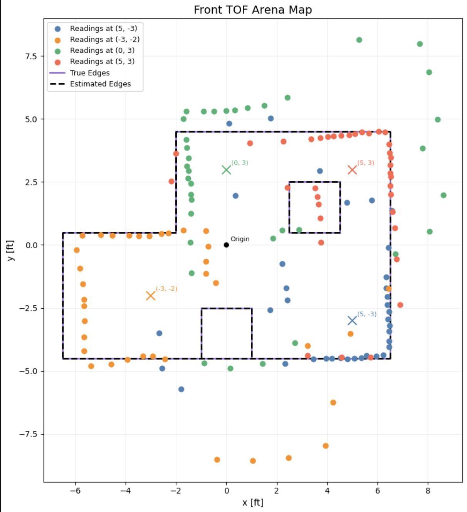
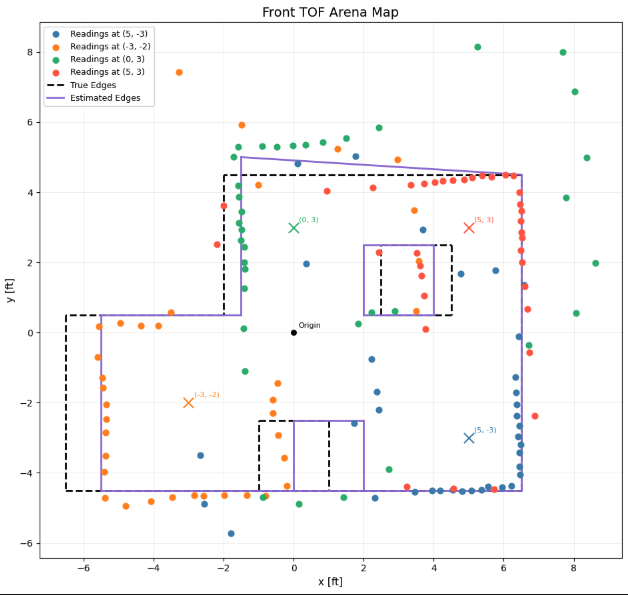

# Lab 9: Mapping

## Objective 

The purpose of this lab is to map out the little world built in the lab lab using ToF distance readings collected from four marked positions of the world. The robot spins in place at each position while recording distances, and the resulting readings are merged using transformation matrices to produce a line-based map for use in a simulation and future labs. 

## Control 

### Orientation control

I chose orientation PID control using the DMP chip for yaw estimation, the same controller I tuned in Lab 6. I collect 36 orientation data points in 10° increments, completing a full 360° rotation. At each step, the orientation PID runs until the yaw error falls within 4° and remains there for 500ms. Once settled, 5 ToF readings are collected from each sensor and averaged before mocing to the next setpoint. 

```c
void run_mapping_scan(float start_yaw) {

  Serial.print("run_mapping_scan start_yaw=");
  Serial.println(start_yaw);
  map_data_index = 0;
  distanceSensor1.startRanging();
  distanceSensor2.startRanging();
  delay(200);

  for (int step = 0; step < MAPPING_STEPS; step++) {
    // 1. Compute target yaw 
    float target = start_yaw + step * MAPPING_INCREMENT;
    while (target > 180.0) target -= 360.0;
    while (target < -180.0) target += 360.0;

    // 2. Run orientation PID until settled 
    orient_setpoint = target;
    orient_integral = 0.0;
    orient_d_filtered = 0.0;
    orient_prev_time = millis();
    orient_prev_yaw = global_yaw;

    unsigned long step_start = millis();
    unsigned long settled_at = 0;
    bool settled = false;

    while (millis() - step_start < 3000) {
      if (get_yaw()) {
        float output = computeOrientPID(global_yaw);
        output = constrain(output, -200, 200);

        float err = global_yaw - orient_setpoint;
        while (err > 180.0) err -= 360.0;
        while (err < -180.0) err += 360.0;

        if (abs(err) < MAPPING_DEADBAND) {
          motorsStop();
          if (!settled) {
            settled = true;
            settled_at = millis();
          }
          if (millis() - settled_at > MAPPING_SETTLE_MS) break;
        } else {
          settled = false;
          motorsOrient((int)-output);
        }
      }
    }
    motorsStop();
    delay(50);

    // 3. Record actual yaw 
    get_yaw();
    map_yaw_data[map_data_index] = global_yaw;

    // 4. Average MAPPING_READINGS from each sensor
    long sum1 = 0, sum2 = 0;
    int cnt1 = 0, cnt2 = 0;
    unsigned long tof_start = millis();

    while ((cnt1 < MAPPING_READINGS || cnt2 < MAPPING_READINGS)
           && millis() - tof_start < 1000) {
      if (cnt1 < MAPPING_READINGS && distanceSensor1.checkForDataReady()) {
        sum1 += distanceSensor1.getDistance();
        distanceSensor1.clearInterrupt();
        cnt1++;
      }
      if (cnt2 < MAPPING_READINGS && distanceSensor2.checkForDataReady()) {
        sum2 += distanceSensor2.getDistance();
        distanceSensor2.clearInterrupt();
        cnt2++;
      }
    }

```

#### Tuning the PID orientation controller

My orientation PID gains are: 
- Kp = 3.5
- Ki = 0.0
- Kd = 0.3

#### Graphs to document PID controller works well + upload video showing robot turning on axis 

The controller is the same one I used in lab 6. 


<iframe width="560" height="315" src="https://www.youtube.com/embed/4kSM23w-bDc?si=N8ZT9cjNbkfqguF-" title="YouTube video player" frameborder="0" allow="accelerometer; autoplay; clipboard-write; encrypted-media; gyroscope; picture-in-picture; web-share" referrerpolicy="strict-origin-when-cross-origin" allowfullscreen></iframe>

#### Given any potential drift in your sensor, the size and accuracy of your increments, and how reliably your robot turns on axis, reason about the average and maximum error of your map if you were to do an on-axis turn in the middle of a 4x4m square, empty room.

## Read out Distances

### 1. execute each turn on marked positions. more locations to improve map. 
Consider whether your robot behavior is reliable enough to assume that the readings are spaced equally in angular space, or if you are better off trusting the orientation from gyroscope values.

I executed the mapping scan at each of the four marked positions: (-3,-2), (5,3), (0,3), and (5,-3). The robot was placed at each mark facing the same direction. 

### 2. Sanity check individual turns by plotting them in polar coordinate plot. Do the measurement match up what you expect? 



### 3. rotate twice or more to see how precise the scans are. 



Not perfect but works. 

## Merge and Plot your readings 

### 1. compute transformation matrices. describe matrices

To convert each ToF reading from the robot's local frame into the global room frame, I applied a 3×3 homogeneous transformation matrix at each angular step:

$$T(\theta, x_r, y_r) = \begin{bmatrix} \cos\theta & -\sin\theta & x_r \\ \sin\theta & \cos\theta & y_r \\ 0 & 0 & 1 \end{bmatrix}$$

where $\theta$ is the robot's DMP yaw at that step and $(x_r, y_r)$ is the robot's known position in the room in mm.

Sensor 2 (front-facing) has its measurement along the robot's $+x$ axis:

$$P_{room} = T \cdot \begin{bmatrix} d_2 + \text{dist} \\ 0 \\ 1 \end{bmatrix}$$

Sensor 1 (right-facing) has its measurement along the robot's $+y$ axis:

$$P_{room} = T \cdot \begin{bmatrix} 0 \\ d_1 + \text{dist} \\ 1 \end{bmatrix}$$

where $d_2 = 90$ mm (sensor 2 forward offset) and $d_1 = 40$ mm (sensor 1 rightward offset).

After plotting the combined scatter, I found that two of the four scan positions required a 180° angular correction to align their data with the room's coordinate frame. Specifically, the scans at (0, 3) and (5, -3) required a 180° correction, while (-3, -2) and (5, 3) required none. Since all four scans were performed within the same BLE session — meaning the DMP never re-initialized and its yaw reference remained consistent throughout — the offset is most likely due to a slight inconsistency in how the robot was placed at those two positions. Despite my best efforts to orient the robot the same way at each mark, the 180° discrepancy suggests the robot was inadvertently placed facing the opposite direction at (0, 3) and (5, -3). The correction was applied as a post-processing angular offset added to all yaw readings from those positions, rotating the entire dataset by 180° to realign it with the room's coordinate system. The resulting point clusters from all four positions align consistently with the known wall geometry, confirming the corrections are appropriate.

### 2. plot all of your tof sensor readings in a single plot. assign different colors to data sets acquired from each turn. 






## Convert to Line-Based Map

### manually estimate where the actual walls/obstacles are based on your scatter plot. draw lines on top of these, and save two lists containing the end points of these lines: (x_start, y_start) and (x_end, y_end)

```python
# ─────────────────────────────────────────────────────────────────────────────
# TRUE EDGES 
# ─────────────────────────────────────────────────────────────────────────────
true_walls_ft = np.array([
    # Outer boundary (L-shaped room)
    [-6.5, -4.5,  6.5, -4.5],   # bottom
    [ 6.5, -4.5,  6.5,  4.5],   # right
    [ 6.5,  4.5, -2.0,  4.5],   # top right
    [-2.0,  4.5, -2.0,  0.5],   # step down
    [-2.0,  0.5, -6.5,  0.5],   # top left
    [-6.5,  0.5, -6.5, -4.5],   # left

    # Interior box obstacle
    [ 2.5,  0.5,  2.5,  2.5],   # left side of box
    [ 2.5,  2.5,  4.5,  2.5],   # top of box
    [ 4.5,  2.5,  4.5,  0.5],   # right side of box
    [ 4.5,  0.5,  2.5,  0.5],   # bottom of box

    # Bottom center obstacle
    [-1.0, -4.5, -1.0, -2.5],   # left side
    [-1.0, -2.5,  1.0, -2.5],   # top
    [ 1.0, -2.5,  1.0, -4.5],   # right side
])

# ─────────────────────────────────────────────────────────────────────────────
# ESTIMATED EDGES — draw these based on where your scatter points cluster
# ─────────────────────────────────────────────────────────────────────────────
estimated_walls_ft = np.array([
    # Outer boundary
    [-5.5, -4.5,  6.5, -4.5],   # bottom
    [ 6.5, -4.5,  6.5,  4.5],   # right
    [ 6.5,  4.5, -1.5,  5.0],   # top right
    [-1.5,  5.0, -1.5,  0.5],   # step down
    [-1.5,  0.5, -5.5,  0.5],   # top left
    [-5.5,  0.5, -5.5, -4.5],   # left

    # Interior box obstacle
    [ 2.0,  0.5,  2.0,  2.5],
    [ 2.0,  2.5,  4.0,  2.5],
    [ 4.0,  2.5,  4.0,  0.5],
    [ 4.0,  0.5,  2.0,  0.5],

    # Bottom center obstacle
    [ 0.0, -4.5,  0.0, -2.5],
    [ 0.0, -2.5,  2.0, -2.5],
    [ 2.0, -2.5,  2.0, -4.5],
])
```


Feel free to correct slight errors found discovered during post processing in this step, but be sure to explain what caused them and how/why you correct them.

```c
starts = [(-1981.2, -1371.6), (1981.2, -1371.6), (1981.2, 1371.6), (-609.6, 1371.6), (-609.6, 152.4), (-1981.2, 152.4), (762.0, 152.4), (762.0, 762.0), (1371.6, 762.0), (1371.6, 152.4), (-304.8, -1371.6), (-304.8, -762.0), (304.8, -762.0)]
ends   = [(1981.2, -1371.6), (1981.2, 1371.6), (-609.6, 1371.6), (-609.6, 152.4), (-1981.2, 152.4), (-1981.2, -1371.6), (762.0, 762.0), (1371.6, 762.0), (1371.6, 152.4), (762.0, 152.4), (-304.8, -762.0), (304.8, -762.0), (304.8, -1371.6)]

```


